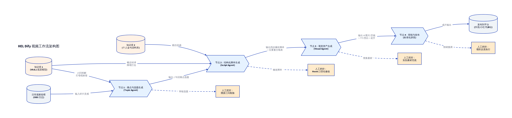

# Dify 视频工作流：框架设计与详细搭建说明

本指南旨在将 HEL（人与环境实验室）的四阶段视频生产流水线，在 Dify 平台上落地为可执行的自动化工作流。

## 一、 为什么选择 Dify？

正如《06-视频生产流水线与工具选型》中所述，HEL 的核心壁垒是**“逻辑编排”**和**“私有化知识库沉淀”**。
*   **严密的逻辑控制**：我们需要 AI 严格按照“找痛点 $\rightarrow$ 写脚本 $\rightarrow$ 做画面”的步骤执行，并在脚本环节严格遵循“四步结构”和“五要素分镜”。Dify 的 Workflow 节点编排能力远强于普通对话机器人。
*   **深度知识库反哺**：我们需要将 V0.6.1 底层模型和不断积累的“个人金句语料库”作为 AI 的思考基底。Dify 的 RAG（检索增强生成）能力能更精准地挂载和检索这些长文本。

## 二、 工作流架构流程图

以下是我们在 Dify 中要搭建的端到端工作流架构图。



*(注：该图展示了从 OBS 日志输入到成片输出的全流程，以及底层模型和语料库的挂载位置，并标明了必须由人工介入的四个关键把控点。)*

## 三、 Dify 工作流详细搭建步骤

在 Dify 中创建一个新的 **“工作流 (Workflow)”** 应用，按照以下步骤搭建节点：

### 节点 0：开始节点 (Start)
*   **输入变量**：
    *   `obs_input` (String/Paragraph)：用户输入的日常观察碎片或 OBS 日志。
    *   `target_platform` (Select)：目标发布平台（抖音/小红书/B站），用于后续调整话术风格。

### 节点 1：痛点与选题生成 (LLM 节点)
*   **节点名称**：`Topic_Agent`
*   **挂载知识库**：选择包含 `V0.6.1底层模型` 和 `八条话题母线` 的知识库。
*   **系统提示词 (System Prompt)**：
    ```text
    你是一个深谙社会心理学与内容传播的选题策划专家。
    请基于用户的观察输入，结合知识库中的 V0.6.1 模型，提取用户的核心痛点。
    运用公式：需求 × 行为 × 环境 × 系统 = 原创选题。
    输出要求：
    1. 分析该现象属于哪一条话题母线。
    2. 输出一个直击痛点、大白话的“一句话选题”。
    3. 必须通过“溯源三问”检验（是否真实？是否普遍？是否触及系统？）。
    ```
*   **用户输入**：`{{obs_input}}`
*   **人工交接点 1**：工作流在此处可设置暂停（或在外部系统中审核），由人类创作者拍板决定是否采用该选题。

### 节点 2：结构化脚本生成 (LLM 节点)
*   **节点名称**：`Script_Agent`
*   **依赖前置节点**：接收 `Topic_Agent` 的输出选题。
*   **挂载知识库**：选择包含 `个人金句语料库` 的知识库（用于模仿语感）。
*   **系统提示词 (System Prompt)**：
    ```text
    你是一个顶级的短视频编导。请根据传入的选题，撰写一个 60-120 秒的视频脚本。
    必须严格遵循以下结构：
    1. Hook（前3秒）：大白话，直击场景痛点。
    2. 共鸣（5-15秒）：描述具体场景，放大情绪。
    3. 降维打击：引入底层逻辑，但必须进行“概念转译”，不说术语，说金句。
    4. 升华：给出情绪抚慰或建议。
    
    请参考目标平台 {{target_platform}} 的调性调整文风。
    最终必须以“五要素分镜表”格式输出（序号、景别、画面描述、旁白、音效/花字）。
    ```
*   **人工交接点 2**：人类创作者必须在此处修改 Hook，使其更口语化，并调整金句。

### 节点 3：视觉资产准备 (工具调用节点组)
*   **节点名称**：`Visual_Assets_Generation`
*   **逻辑说明**：利用 Dify 的工具/插件能力（或通过 HTTP 请求调用外部 API）。
*   **分支 1 (图像生成)**：调用如 DALL-E 3 或 Midjourney API，传入 `Script_Agent` 输出的画面描述，生成所需的背景图或空镜。
*   **分支 2 (TTS 语音)**：调用高质量 TTS API（如火山引擎），传入脚本中的旁白文本，生成音频文件。
*   **人工交接点 3**：人类创作者检查生成的素材，必要时用自己的实拍素材进行兜底替换。

### 节点 4：标准化拼装与输出 (代码/文本处理节点)
*   **节点名称**：`Final_Assembly_Instructions`
*   **逻辑说明**：由于 Dify 无法直接进行视频剪辑，此节点用于输出给剪辑师（或人类创作者自己）的“最终执行清单”。
*   **输出内容**：
    *   完整的最终版旁白文本。
    *   提取出的核心“花字”清单。
    *   剪辑时的“视听反差”执行提示（如：“在第 15 秒转折处，要求画面变亮，BGM 切换”）。

### 节点 5：结束节点 (End)
*   **输出变量**：将上述节点 4 的执行清单以及生成的素材链接作为最终输出返回给用户。

## 四、 实施建议

1.  **先跑通 MVP**：不要一开始就追求全自动化。可以先只在 Dify 中搭建“节点 1”和“节点 2”，手动复制脚本去剪映里制作，验证逻辑通顺后再逐步接入 API。
2.  **知识库的持续投喂**：Dify 工作流的灵魂在于知识库。您平时随手写的感悟、爆款文案，都要不断追加到 `个人金句语料库` 中，让 AI 的“文笔”越来越像您。
3.  **守住人工底线**：牢记“人管灵魂与决策、AI 管效率与执行”。AI 写的 Hook 如果不够“扎心”，您必须亲自下场改，这是机器无法替代的“人味”。
