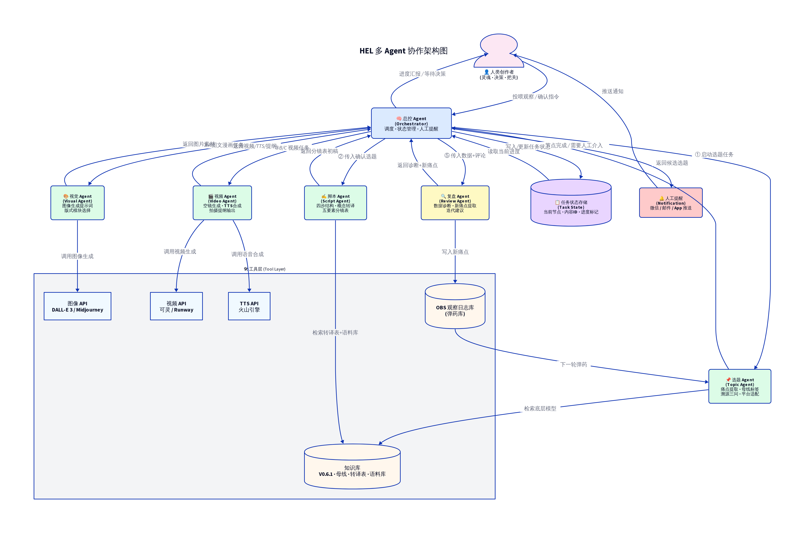

# HEL 多 Agent 协作架构与 Dify 搭建指南

为了实现 HEL（人与环境实验室）内容生产流水线的高度自动化与精准把控，我们设计了一套**以"总控 Agent"为核心的多 Agent 协作架构**。

这套架构将原本单线的 Workflow 升级为"一主多从"的智能体网络，总控 Agent 负责整体进度的推进和人工提醒，而各个子 Agent 则专注于自己擅长的垂直领域。

---

## 一、多 Agent 协作架构图



### 架构核心理念：
1. **中枢调度**：总控 Agent（Orchestrator）是唯一直接与人类创作者交互的节点，它负责解析人类的模糊指令，并将其分发给对应的子 Agent。
2. **状态持久化**：引入了"任务状态存储"，总控 Agent 知道每一条内容当前处于哪个阶段（选题中/脚本中/待审核/已发布），不会出现进度丢失。
3. **人工把控前置**：在必须人工介入的节点，总控 Agent 会通过"人工提醒"模块主动呼叫创作者，等待决策后再推进下一步。

---

## 二、Agent 角色分工与 Dify 搭建方案

在 Dify 中，我们将采用 **"多 Agent 协作 (Multi-Agent)"** 模式来搭建。

### 1. 总控 Agent (Orchestrator)
*   **角色定位**：项目经理、进度追踪者。
*   **核心能力**：意图识别、工具调用（调用其他 Agent）、状态读写。
*   **系统提示词**：
    ```text
    你是 HEL 内容流水线的总控 Agent。你的任务是协调各个子 Agent 完成内容生产。
    
    【工作流纪律】
    1. 当用户输入观察碎片时，调用 [Topic_Agent] 生成选题。
    2. 选题生成后，必须暂停并提醒用户审核。只有用户回复"确认"或修改后，才能调用 [Script_Agent]。
    3. 脚本生成后，再次提醒用户审核金句。用户确认后，根据内容形式调用 [Visual_Agent] 或 [Video_Agent]。
    4. 收到数据反馈时，调用 [Review_Agent] 进行诊断。
    
    【当前状态】
    在每次回复前，请先读取当前任务状态，并告诉用户当前处于哪个阶段，下一步需要用户做什么。
    ```

### 2. 选题 Agent (Topic Agent)
*   **角色定位**：社会学研究员、选题策划。
*   **挂载知识库**：V0.6.1 底层模型、八条话题母线。
*   **系统提示词**：
    ```text
    你是选题策划专家。请基于输入的碎片，用 V0.6.1 模型的 15 个问题进行内部拆解。
    必须通过"溯源三问"（真实/普遍/触及系统）的检验。
    输出：1. 所属母线与专栏；2. 内部核心机制；3. 适配目标平台的大白话选题。
    注意：对外输出的选题中绝对不能包含学术术语。
    ```

### 3. 脚本 Agent (Script Agent)
*   **角色定位**：短视频编导、爆款文案。
*   **挂载知识库**：概念转译对照表、个人金句语料库。
*   **系统提示词**：
    ```text
    你是短视频编导。请严格按照"Hook(前3秒) -> 共鸣(5-15秒) -> 降维打击 -> 升华"的四步结构撰写脚本。
    必须严格执行知识库中的《概念转译对照表》，将所有底层逻辑翻译为大众语言。
    请模仿知识库中《个人金句语料库》的语感，输出"五要素分镜表"。
    ```

### 4. 视觉/视频 Agent (Visual/Video Agent)
*   **角色定位**：美术指导、视听合成。
*   **工具接入**：DALL-E 3 / Midjourney API（图像）、可灵 API（视频）、火山引擎 TTS API。
*   **系统提示词**：
    ```text
    你是美术指导。请根据脚本分镜表：
    1. 若为图文漫画：生成治愈系水彩风格的图像 Prompt，并调用绘图工具。
    2. 若为空镜+TTS：生成空镜 Prompt 调用视频工具，提取旁白调用 TTS 工具。
    3. 提取核心金句作为花字清单。
    确保视觉呈现真实、克制，符合中国家庭场景。
    ```

### 5. 复盘 Agent (Review Agent)
*   **角色定位**：数据分析师、系统迭代者。
*   **工具接入**：读写 `03-观察日志` 数据库。
*   **系统提示词**：
    ```text
    你是数据分析师。请根据完播率、互动率、收藏率诊断内容效果。
    从评论区摘录中提取新的痛点和场景，将其格式化为新的观察日志，并写入弹药库。
    给出是否将其做成系列内容的建议。
    ```

---

## 三、实施路径建议

在 Dify 中搭建多 Agent 协作，建议采用以下路径：

1.  **独立调试**：先不要建总控，把 Topic、Script、Review 这三个纯文本 Agent 作为独立的"聊天助手"建出来，挂载好知识库，反复调试 Prompt，直到输出质量稳定。
2.  **构建总控**：在 Dify 中新建一个 "Agent" 应用，将之前调好的三个独立 Agent 作为 **"工具 (Tools)"** 添加给总控 Agent。
3.  **API 接入**：最后再处理最复杂的 Visual/Video Agent，这需要开发少量的中转代码来对接外部生图/视频 API，并将其封装为 Dify 可调用的自定义插件。
