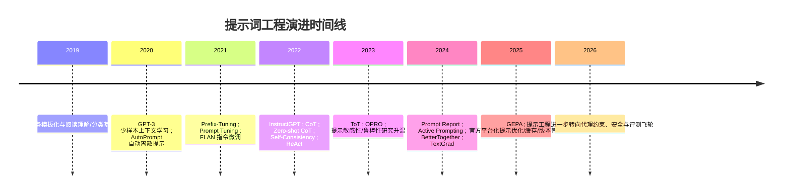
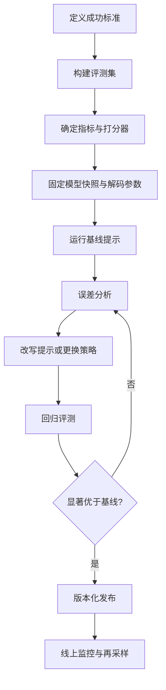

# 提示词工程研究报告

## 执行摘要

本文将“提示词工程”界定为：围绕大模型输入上下文的**设计、组织、约束、优化与评测**的一整套方法学，目标是在**不改动或少改动模型参数**的前提下，稳定提升任务表现、降低成本并控制风险。为便于聚焦，本文默认目标读者为**AI 研究者与工程实践者**；“截至 2026-06”的材料包含**原始论文、官方技术文档、官方模型卡与高影响力预印本**。需要强调的是，不同论文与平台的提示模板、解码参数、上下文窗口和评测脚本并不完全一致，因此跨模型结论更适合作为**趋势判断**而非“绝对排行榜”。citeturn0academia35turn23academia12turn11search0turn16search0

近五年的主线很清晰：**2019–2020** 是“离散提示/少样本上下文学习”确立阶段；**2021–2022** 进入“软提示/参数高效调优 + 指令微调 + 链式思维”阶段；**2023–2024** 扩展到 ReAct、Tree-of-Thought、自动提示优化、评测驱动迭代与工具增强；**2025–2026** 则更明显地转向**程序化提示管理、数据集驱动优化、提示版本化、缓存降本、代理安全与多模型协同**。这意味着“提示词工程”已经不再只是写一句好指令，而是演变为**提示—评测—优化—部署**的工程闭环。citeturn1search0turn2search0turn2search2turn3academia24turn3search0turn1academia24turn34academia13turn33academia12turn19academia13turn19search0turn15search2

从方法上看，**零样本/少样本/模板化**适合低成本快速上线；**链式思维、计划式提示、自一致性、ReAct**更适合复杂推理与信息不足场景；**指令微调、软提示、Prefix/P-tuning**适合稳定批量任务；**自动提示生成与优化工具**则适合中大型团队把经验沉淀为可复用资产。不同任务并不存在“万能提示”：数学与代码往往受益于分步规划与多样采样，而翻译任务中显式 CoT 甚至可能带来退化；信息抽取与分类往往更依赖**标签定义、输出约束与示例平衡**。citeturn1academia24turn1academia27turn16search2turn34academia13turn24search6turn30search6turn30academia26turn17academia13

模型层面，**GPT 类闭源模型**在通用指令遵循、长上下文、工具调用和工程可用性上通常更省提示成本；**LLaMA/Mistral/Qwen/DeepSeek 等大开源模型**对**聊天模板、格式约束、示例质量**更敏感，但在可控部署、成本和二次优化上更有优势；**专用小模型**在经过蒸馏、领域后训练或任务定制后，常能在窄任务上逼近甚至超过更大的通用模型，尤其在代码、数学、医疗等高重复结构场景。citeturn31search0turn31search1turn13search0turn3academia28turn6search1turn13academia14turn14academia12turn23search1turn14academia13

工程上最重要的结论有三点。第一，**提示必须和评测绑在一起**：没有数据集、误差分析和显著性检验，所谓“更好的提示”常常只是偶然。第二，**结构化输出、版本化与缓存**比“花式咒语”更容易带来真实收益。第三，随着模型具备检索、工具和动作能力，提示词工程的核心问题正从“如何诱导回答”转向“如何约束代理、分配上下文、定义成功标准并防 prompt injection”。citeturn11search0turn20search0turn19search3turn15search0turn15search2

## 定义与发展历程

“提示词工程”一词在今天有两个层次。狭义上，它指编写高质量自然语言指令、示例和输出格式；广义上，它包括**上下文构造、示例选择、工具调用约束、软提示学习、提示优化器、评测集与版本管理**。Google、OpenAI 与 Anthropic 的官方说明都把它视为一种**迭代式设计活动**，而不是一次性写作技巧。citeturn12search4turn0search4turn0search2turn8search7

2019–2020 的关键节点，是提示从“探针/probe”走向“通用任务接口”。CMRC 2018 这类中文阅读理解基准、CLUE 这类中文综合基准，推动了中文任务模板化输入的发展；而 GPT-3 则把“少样本上下文学习”推到中心位置，证明**仅靠文本上下文**就能在翻译、问答与完形填空等多类任务上获得强表现。与此同时，AutoPrompt 证明离散提示可以通过梯度搜索自动构造，提示不再只能靠人工经验。citeturn21search0turn21academia24turn1search0turn2academia32

2021–2022 是提示词工程“方法论爆发期”。一方面，Prefix-Tuning、Prompt Tuning 等工作把提示从“离散文本”扩展为**可学习的连续向量前缀**，在冻结主模型参数时仍能获得接近全参数微调的效果；另一方面，FLAN/InstructGPT 说明**指令微调**能够系统提升零样本泛化与用户意图对齐，甚至让较小模型在偏好评测中超过更大的未对齐模型。citeturn2search0turn2search2turn3academia24turn3search0

同一时期，链式思维成为提示工程的标志性里程碑。CoT 证明，给出中间推理示例可以显著提升数学、常识和符号推理；Zero-shot CoT 表明一句“Let’s think step by step”也能在多种推理基准上显著改善结果；Self-Consistency 则进一步通过多路径采样与答案边际化提升表现。随后，Auto-CoT、Plan-and-Solve、ReAct、Tree-of-Thought 把提示从“单条指令”推进到**计划、搜索、反思与行动交织**的推理框架。citeturn1academia24turn1academia26turn1academia27turn1academia28turn16search2turn34academia13turn34academia12

2023–2024 的变化，是提示工程从“技巧集合”走向“系统工程”。The Prompt Report 与多篇综述已经把提示技术组织为完整谱系；与此同时，研究开始强调**提示敏感性、跨模型迁移差、鲁棒性不足**。EMNLP 2023 的研究表明，语义等价但语言形态不同的提示在不同模型和数据集上转移性很差；另一些工作则显示，开源模型对格式变化的性能波动可能非常大。citeturn0academia35turn25academia39turn16search0turn16academia15

到 2025–2026，行业实践的重心明显转变。OpenAI、Google、Anthropic、Mistral、Qwen、DeepSeek 的官方文档都把提示设计和**评测、缓存、结构化输出、工具调用、代理安全、当前日期/知识边界控制**一起讨论；DSPy、OpenAI Prompt Optimizer、TextGrad、GEPA/OPRO 等工具则把“提示优化”从手工试错推进为**带训练集、打分器和优化器的程序化流程**。换言之，提示词工程正逐步融入“LLM 应用工程”的主干，而不再是边缘技巧。citeturn19search0turn19search3turn19academia13turn19academia15turn32academia2turn33academia12turn12search0turn4search2turn5search12turn5search1



该时间线总结自原始论文与官方平台文档。citeturn1search0turn2academia32turn2search0turn2search2turn3academia24turn3search0turn1academia24turn34academia13turn34academia12turn33academia12turn19academia15turn32academia2turn19search0

## 方法与技术分类

### 零样本、少样本与模板化提示

零样本提示的原理，是把任务说明直接编码进自然语言指令，让模型依赖预训练知识完成任务；少样本则在上下文中再加入少量输入—输出示例，借助上下文学习诱导任务映射。模板化提示则把这两者工程化：固定角色、目标、约束、上下文和输出格式，以降低任务漂移。GPT-3 证明了少样本范式的通用性；Google 与 OpenAI 的官方文档则强调，**清晰任务描述、明确约束与输出格式**仍是多数任务的首要增益来源。citeturn1search0turn12search4turn0search4turn7search4

少样本的实现要点不是“多给几个例子”这么简单，而是要控制**示例覆盖面、标签平衡、格式一致性和与真实输入的邻近性**。研究已经显示，示例选择与格式变化会明显影响表现，且不同模型之间往往不能直接迁移最优提示。对于开源指令模型，是否使用其原生 chat template 也非常关键。citeturn16search0turn16academia15turn6search0turn6search1

这一类方法的优点是成本最低、迭代最快、几乎无训练门槛；缺点是**稳定性受提示措辞、示例顺序、标签偏置影响较大**，在复杂推理与高度结构化任务上常不够稳。citeturn17academia12turn17academia13turn16academia13

### 链式思维、计划式提示与行动式提示

CoT 的核心是让模型先生成中间推理，再给出答案；Zero-shot CoT 用简单触发语诱导这一过程；Self-Consistency 用多路径采样缓解单一路径错误；Plan-and-Solve 把“先规划再求解”显式化；ReAct 把推理与外部行动交织；ToT 则把推理扩展为树搜索。它们本质上都在做一件事：**把原本隐式的求解过程外显化、分解化或可搜索化**。citeturn1academia24turn1academia26turn1academia27turn16search2turn34academia13turn34academia12

这类方法特别适合**数学、复杂问答、规划、代码修复、工具调用**等需要多步推理的任务，但不一定适合翻译和简短分类。WMT 2023 的研究甚至发现，在机器翻译里显式 CoT 可能诱发逐词翻译，从而显著劣化质量。换言之，CoT 不是通用增益器，而是**任务条件性很强的推理放大器**。citeturn24search6turn24academia12

需要特别指出，**当代 reasoning model 与传统 instruct model 对 CoT 的响应不同**。OpenAI 与 Google 的官方指南都指出，面向内置“思考”机制的模型，过度要求显式“逐步思考”有时并不会带来额外收益，甚至可能增加成本或损害输出简洁性；这与 2022 年经典 CoT 论文针对当时模型的结论并不矛盾，因为模型族与训练方式都已改变。citeturn31search0turn12search0turn1academia24

### 指令微调、软提示与自动提示优化

指令微调通过在多任务指令数据上继续训练，让模型学会更稳定地遵循“任务描述 + 约束 + 输出格式”；软提示、Prefix-Tuning、Prompt Tuning 则通过学习少量任务特定向量来条件化冻结模型。前者更像**模型层面对提示友好性做改造**，后者更像**把提示本身变成可训练参数**。citeturn3academia24turn3academia26turn3search0turn2search0turn2search2

自动提示优化则把“写提示”转成“搜索/编译/进化/文本梯度”问题。AutoPrompt 用梯度搜索离散 token；OPRO 直接用 LLM 优化指令；DSPy 把任务声明为签名与模块，再用优化器根据指标自动找提示与示例；TextGrad 用“文本梯度”回传反馈；GEPA 进一步把自然语言反思和 Pareto 演化结合起来，在若干任务上以更少 rollout 超过 RL 与传统优化器。OpenAI 的 Prompt Optimizer、Anthropic 控制台提示生成器、LangSmith 的数据集—评测—实验流，则体现了行业侧把这些思想产品化。citeturn2academia32turn33academia12turn19academia13turn19academia15turn32academia2turn19search0turn8search0turn20search0

下表给出常用方法的简化对照。

| 方法 | 原理 | 优点 | 短板 | 适用场景 |
|---|---|---|---|---|
| 零样本 | 单条任务说明直接触发能力 | 快、便宜、启动门槛低 | 易受措辞影响 | 分类、摘要、简单问答 citeturn0search4turn12search4 |
| 少样本 | 上下文示例诱导任务映射 | 常显著提升稳定性 | 示例选择/顺序敏感 | 分类、抽取、翻译、代码样例驱动 citeturn1search0turn16academia15 |
| CoT | 显式中间推理 | 强化复杂推理 | 成本高，非推理任务可能退化 | 数学、逻辑、代码推理 citeturn1academia24turn24search6 |
| Self-Consistency | 多路径采样后投票 | 降低单路径错误 | 调用成本上升 | 数学、常识推理 citeturn1academia27 |
| ReAct | 推理与行动交织 | 降低幻觉，利于工具调用 | 轨迹复杂、易受注入攻击 | 检索问答、代理任务 citeturn34academia13turn15search2 |
| 指令微调 | 多指令数据后训练 | 普遍降低“提示负担” | 需要训练数据与训练成本 | 产品化通用助手 citeturn3academia24turn3search0 |
| 软提示/Prefix | 学习连续前缀 | 参数高效、可多任务复用 | 可解释性弱，跨模型迁移差 | 固定批量任务 citeturn2search0turn2search2 |
| 自动提示优化 | 以指标驱动搜索/编译/反思 | 可系统迭代、可版本化 | 依赖高质量评测与打分器 | 中大型应用、持续优化 citeturn19academia13turn19academia15turn32academia2turn19search0 |

## 不同模型与任务上的效果

先给出总判断：**模型能力越强、越对齐、越原生支持结构化输出与工具调用，人工“雕刻提示”的边际收益通常越低；模型越小、越开源、越通用基座化，良好的模板、chat template、示例与输出约束就越重要。**这也是为什么今天闭源 GPT 类系统的提示实践更强调“清晰与评测”，而许多开源部署更强调“模板、采样参数、示例检索和编译器式优化”。citeturn31search0turn0search4turn16academia15turn6search0turn6search1

在**GPT 类模型**上，历史演进体现得最明显：GPT-3 打开了少样本范式，InstructGPT 通过 SFT+RLHF 让“遵循指令”成为默认能力，近年的 GPT 系官方文档则更强调**结构化输入、工具调用、长上下文组织与评测飞轮**。OpenAI 还明确区分了 GPT 模型与 reasoning 模型：前者更适合低延迟、定义清晰的执行任务，后者更适合复杂歧义规划。citeturn1search0turn3search0turn31search0turn31search1

在**大型开源模型**上，LLaMA、Mistral、Qwen、DeepSeek 呈现出两个共性。第一，指令版通常相较 base/base-chat 有显著更好的对话与通用任务表现；第二，它们对**模板兼容性**更敏感。Meta 的 Llama 3 模型卡报告其在 MMLU、SQuAD、BoolQ、BBH 等标准基准上显著优于 Llama 2；Mistral 7B 论文报告其超过 Llama 2 13B，并且 Instruct 版在人类与自动基准上优于 Llama 2 13B-Chat；Qwen2.5 技术报告则强调其在长文本生成、结构化数据分析与指令遵循上的提升。citeturn13search0turn13search1turn3academia28turn6search0turn13academia13turn6search1

在**专用小模型**上，结论更细：通用小模型在开放域复杂任务上仍逊于强大闭源或大开源模型，但在**延迟、成本、边缘部署、窄任务蒸馏**上非常有竞争力。Phi-3 技术报告显示，3.8B 的 Phi-3-mini 在若干通用基准上已能逼近更大模型；TinyGSM 则显示 1.3B 模型在 GSM8K 上可达 80.1%；医疗小模型 RadPhi-3 则在放射学任务上实现了强领域表现。这说明提示工程和蒸馏/后训练结合后，小模型在垂直场景中往往是更优的经济解。citeturn14academia12turn14search0turn23search1turn14academia13

按任务来看，可以归纳为下表。

| 任务 | GPT 类 | 大开源模型 | 专用小模型 | 关键提示因素 |
|---|---|---|---|---|
| 文本生成/对话 | 指令跟随强，长上下文与工具支持好；提示更偏“清晰约束”而非花式技巧。citeturn31search1turn0search4 | Llama 3、Mistral Instruct、Qwen2.5-Instruct 表现强，但更依赖正确 chat template。citeturn13search0turn6search0turn6search1 | 适合客服、分类、短生成等低延迟场景。citeturn14search0turn14academia12 | 角色、语气、长度、输出格式、上下文排序 |
| 问答/知识 | GPT-3 起步，指令微调后明显更稳。citeturn1search0turn3search0 | Llama 3 在 MMLU/SQuAD/BoolQ 等显著优于前代；Qwen2.5 旗舰接近/对标更大模型。citeturn13search1turn13academia13 | 中文/领域 QA 可通过蒸馏与任务定制获得高性价比。citeturn21search0turn14academia13 | 检索上下文分隔、答案约束、拒答条件 |
| 数学/推理 | CoT、Self-Consistency、Plan-and-Solve、ReAct 等常有效。citeturn1academia24turn1academia27turn16search2turn34academia13 | 开源模型受益显著，但格式和示例敏感。citeturn16academia15turn34search0 | 小模型经蒸馏后在数学上可非常强。citeturn23search1turn13academia12 | 分步求解、采样投票、计划先行 |
| 代码 | GPT/Codex 开创 pass@k 评测范式。citeturn22academia0 | Qwen2.5-Coder、DeepSeek-V3/2.5、Mistral 在代码上强于同规模通用模型。citeturn13academia15turn13academia14turn5search9turn3academia28 | 代码小模型适合本地代理与边缘 IDE。citeturn14search0turn14academia14 | 明确 I/O、测试约束、是否允许工具/执行 |
| 翻译 | 高资源方向很强，但低资源和文档级一致性仍不稳定。citeturn24academia12 | 开源 LLM 纯 prompting 往往不如专门 MT 系统；QLoRA/微调常更有效。citeturn24search1 | 窄领域可借词典/RAG/迭代约束提升。citeturn24academia13turn24academia14 | 术语表、文体约束、不要盲目 CoT |
| 摘要 | 通用模型易用，但长文档更依赖分块与多阶段提示。citeturn25academia36turn12search0 | 长上下文能力更强的模型优势明显。citeturn13academia13turn31search1 | 面向固定文档类型时，小模型可胜在吞吐与成本。citeturn14academia14 | 受众、长度、保真度、覆盖点清单 |
| 信息抽取 | 零样本可用，但与 SOTA IE 仍可能有差距。citeturn30academia25turn30search6 | 开源模型在定义清晰、JSON 约束好时提升明显。citeturn30academia24turn6search1 | 垂直领域小模型很有潜力。citeturn14academia13turn30search0 | 标签定义、输出 schema、边界条件与 few-shot 平衡 |

这里尤其值得强调两点。第一，**任务异质性远大于模型家族差异**：推理任务更受“思维分解”影响，抽取任务更受“标签定义与 schema”影响，翻译任务更受“术语/文体/忠实度”影响。第二，提示在不同模型之间转移性并不可靠，特别是在开源模型、不同 chat template、不同语言之间。citeturn16search0turn16academia15turn24search6turn30academia24

## 评估与度量

提示词工程的评估，至少应分成三层。第一层是**任务指标**：分类看 Accuracy、Macro-F1、EM；问答看 EM/F1；摘要看 ROUGE、BERTScore；翻译看 BLEU、COMET/BERTScore；代码看 pass@k；对话则常结合人工评分或 LLM-as-a-judge。第二层是**系统指标**：延迟、首 token 时间、token 用量、成本、失败率。第三层是**风险指标**：偏置、鲁棒性、安全、拒答行为和越权行为。HELM 的价值就在于把准确性、校准、鲁棒性、公平性、毒性和效率放到同一框架里看。citeturn23academia12turn26search0turn26search1turn27academia24turn22academia0turn11search0

基准上，通用知识与推理常用 **MMLU/CMMLU、BBH、GSM8K**；代码常用 **HumanEval、MBPP**；中文理解可用 **CLUE、CMRC 2018、FewCLUE、CBLUE**；摘要可用 **CNN/DailyMail、XSum**；翻译可用 **WMT/FLORES**。如果目标是中文或中文专业场景，直接套用英文基准常会高估提示迁移能力，因此最好同时保留中文测试集。citeturn22academia1turn22academia2turn23academia13turn22academia0turn9academia12turn21academia24turn21search0turn21academia30turn21search2

常用自动指标并不等价。BLEU 擅长表层 n-gram 重叠，ROUGE 适合摘要召回视角，BERTScore 更强调语义相似；代码任务里 pass@k 更接近“能否运行通过”，比纯文本相似度更可信。对于开放生成和对话，单一自动分数往往不足，必须结合人工 rubric 或有校准的 LLM judge。citeturn26search0turn26search1turn27academia24turn22academia0turn11search0turn20search1

可重复实验设计至少要固定以下因素：**模型快照、采样参数、chat template、系统/开发者消息、few-shot 示例选择规则、上下文长度、评测脚本、随机种子、数据版本**。OpenAI、LangSmith 等官方评测文档都建议把数据集版本化，并在每次提示修改时跑回归评测；OpenAI 还明确建议将生产应用 pin 到模型快照并持续监控 prompt 表现。citeturn0search4turn11search0turn20search0turn20search2

统计检验方面，经验上不应只报一个均值。对分类/抽取任务，可报告多次重复后的均值与标准差，并使用 **McNemar** 或近似随机化/置换检验；对 BLEU/ROUGE 这类语料级指标，**bootstrap 重采样**与随机化检验仍是稳妥选择。Dror 等人还专门给 NLP 论文写过“显著性检验指南”，强调要根据任务和指标匹配检验方法。citeturn28search0turn28search2turn28search3



这个流程体现了当前行业文档与研究共同强调的“评测飞轮”。citeturn11search0turn20search0turn19search0

## 局限性与风险

首先是**偏见与标签偏置**。提示并不会消除模型原有偏见，反而可能因标签词选择、示例分布和措辞框架而放大。已有工作发现 few-shot 提示可能出现显著的预测偏差和标签偏置；在某些设定下，看似“性能更高”的提示只是偏向某些答案。citeturn17search0turn17academia12turn17academia13turn17search3

其次是**鲁棒性和提示敏感性**。大量研究表明，语义等价的改写、格式变化、同义词替换甚至轻微 typo，都可能让结果大幅波动；这种波动在开源模型与小模型上通常更明显。换言之，提示成功常不是“学到了任务本质”，而是碰巧命中了模型偏好的表达方式。citeturn16search0turn16academia12turn16search1turn16academia15

第三是**可解释性有限**。虽然 CoT 看起来让模型“解释了自己的思路”，但不少研究提醒：模型生成的推理痕迹并不一定忠实反映其真实计算过程，至少不能被简单视作内部机制解释。更稳妥的说法是：CoT 往往是**有用的外部求解脚手架**，而不是可靠的认知显微镜。citeturn18search0turn18search2turn18academia15

第四是**泄露与安全**。Prompt injection 已从“覆盖系统提示”演化为更接近社会工程学的攻击，尤其在代理接入网页、文件、邮箱、知识库和执行工具后，第三方上下文可诱导泄露、偏航和越权操作。OpenAI 的 2025–2026 安全文档明确把 prompt injection 视为前沿挑战；研究界也已证明间接注入和多模态注入普遍有效。citeturn15search0turn15search2turn15academia39turn15academia38

最后是**算力与成本**。提示工程常被误解为“免费的性能提升”，但更长的上下文、更高的采样次数和自一致性投票都直接增加 token 成本和延迟。OpenAI、Anthropic、DeepSeek 的官方文档都明确按 token 计费；同时，提示缓存虽然能显著降本，但要求静态前缀高度复用，这会反过来影响你如何组织提示。citeturn29search0turn8search1turn5search2turn19search3

## 最佳实践与可验证实验方案

### 最佳实践与操作指南

当前较稳健的通用模板，不是“越长越玄”，而是**越清晰越好**。一个高质量提示通常包含：角色/身份、任务目标、输入边界、可用上下文、硬约束、输出 schema、示例以及失败时的处理规则。Google、Mistral、OpenAI 都建议使用明显的分隔符、层次化结构，并将静态说明放前、动态输入放后。citeturn12search0turn4search2turn19search3turn0search4

一个适合多数任务的文本模板如下：

```text
# 角色
你是{角色}。

# 任务
请完成{明确任务}。

# 约束
- 仅依据给定上下文回答
- 若信息不足，明确说明“不足以判断”
- 不要输出未请求内容

# 输入上下文
{context}

# 输出格式
请按如下 JSON 返回：
{
  "answer": "...",
  "evidence": ["..."],
  "confidence": 0.0
}
```

这种模板的价值在于：它把“身份、任务、约束、上下文、格式”解耦，便于版本化与自动优化；对开源模型尤其重要，因为输出 schema 与边界条件写得越明确，提示敏感性通常越低。citeturn12search0turn0search4turn16academia13

推荐的调参流程是：先定**任务成功标准**，再调**输出格式**，然后调**示例**，最后才动**温度/采样数**。对推理任务，先测零样本，再加 CoT/Plan-and-Solve/自一致性；对抽取与分类，先测 schema 与标签定义，再测 few-shot；对翻译和摘要，先测术语表/长度与忠实度约束，不要默认加 CoT。citeturn31search0turn24search6turn30academia24turn25academia36

工具方面，若是研究与中大型工程团队，优先推荐以下组合：**OpenAI Prompt Optimizer + Evals** 做闭环；**DSPy/GEPA** 做程序化优化；**LangSmith** 做数据集、评测与版本管理；**Anthropic Console** 做提示生成与测试；中文生态里可参考 **Qwen 官方文档** 和 **DeepSeek 提示库** 做模板基线。citeturn19search0turn11search1turn19academia13turn32academia2turn20search0turn8search0turn5search12turn5search1

### 可复现实验方案

下面给出三个可直接落地的实验，尽量兼顾中文、开源可复现与任务多样性。

| 实验 | 数据 | 模型 | 提示设置 | 指标 | 预期结果 |
|---|---|---|---|---|---|
| 中文分类提示敏感性 | FewCLUE 或 CLUE 分类子集 | Qwen2.5-7B-Instruct、Llama 3 8B Instruct、Phi-3-mini | 对比：零样本简述、结构化零样本、3-shot 平衡示例、自动优化版 | Accuracy、Macro-F1、方差 | 结构化提示显著降低方差；3-shot 常优于裸零样本；小模型收益更大。citeturn21academia24turn21academia30turn6search1turn13search0turn14search0turn16academia13 |
| 数学推理提示策略 | GSM8K | Qwen2.5-7B-Instruct、Mistral-7B-Instruct、Phi-3-mini | 对比：直接答、Zero-shot CoT、Plan-and-Solve、Self-Consistency | Accuracy、token 成本、延迟 | CoT/Plan-and-Solve 普遍优于直接答；Self-Consistency 最好但成本最高；小模型也能显著受益。citeturn23academia13turn1academia26turn16search2turn1academia27turn6search0turn14search0 |
| 中文抽取结构化输出 | CBLUE 中 NER/IE 子任务，或公开中文医学抽取集 | Qwen2.5-7B-Instruct、DeepSeek、Phi-3-mini/RadPhi-3 | 对比：自然语言抽取、JSON schema 抽取、label definition + 2-shot、自动优化版 | Precision/Recall/F1、非法 JSON 率 | 明确 schema 与标签定义能显著降低非法输出和边界错配；领域小模型在医疗场景性价比高。citeturn21search2turn30search0turn30academia24turn5search1turn14academia13 |

给出一个**实验二**的最小提示示例：

```text
你将解决一个小学数学应用题。
请先用简短步骤推理，再在最后一行输出：
答案：<数字>

题目：
{question}
```

以及一个 **Plan-and-Solve** 变体：

```text
先列出解题计划，再逐步执行计划。
不要跳步。
最后一行只输出：
答案：<数字>
```

这两种模板足以复现“直接答 vs 分步规划”的主差异。若进一步做 Self-Consistency，可在同一问题上采样 n=5 或 n=10，再对最终答案多数投票。citeturn1academia26turn16search2turn1academia27

为了保证这些实验真正可复现，建议最少做到：固定模型版本、温度、top-p、max tokens、chat template；保存每轮完整提示文本；将数据集切分与示例选择规则写入配置文件；每个设置至少跑 3 次；报告均值、标准差与显著性检验；对失败样例做错误分类，例如“标签歧义、边界丢失、幻觉补全、格式错误”。citeturn20search2turn11search0turn28search2

## 未来方向与附表

未来两到三年的研究重点，大概率不再是“是否还有新咒语”，而是五个更硬的问题。其一，**自动提示优化**会继续从启发式搜索走向因果/反思/多目标优化，目标是更少 rollout、更强鲁棒性与更低成本。其二，**提示与微调的联合优化**会越来越重要，因为单靠写提示已难以榨干模型性能。其三，**代理安全**会成为提示工程的核心分支。其四，**多语言与中文评测**会更受重视，因为英文最优提示并不可靠迁移到中文。其五，随着 MCP、工具调用和长上下文普及，提示工程会越来越像**上下文工程**。citeturn32academia2turn32academia3turn33academia13turn15search2turn22academia2turn23academia15turn8search6

面向应用场景，最成熟的方向包括：企业知识问答、检索增强总结、客服分类与回复草拟、表单/合同/医学报告抽取、代码生成与修复、教育辅导、翻译后编辑、投研与法务文档分析。共同模式是：**先用提示工程快速达到可用，再用评测飞轮决定是否进入蒸馏、微调或小模型替换阶段**。citeturn11search0turn7search0turn14academia14

### 附表

#### 方法对比与推荐资源

| 方法 | 推荐模型/资源 | 适用场景 | 备注 |
|---|---|---|---|
| 结构化零样本 | GPT 类、Qwen2.5-Instruct、Gemini、Claude | 快速上线、格式化输出 | 优先写清任务、约束、schema。citeturn0search4turn6search1turn12search0turn8search7 |
| 少样本提示 | GPT-3/4.x、Llama 3 Instruct、Mistral Instruct | 分类、抽取、翻译 | 示例质量、平衡与格式一致性最关键。citeturn1search0turn13search0turn6search0turn16acad​emia15 |
| CoT / Plan-and-Solve | 推理模型、Qwen-Math、Phi-3、小到中型开源指令模型 | 数学、逻辑、代码解释 | 不建议默认用于翻译。citeturn31search0turn13academia12turn14academia12turn24search6 |
| ReAct / 工具增强 | OpenAI Responses、Claude、Gemini、DSPy | 检索问答、代理、工具调用 | 需同步设计防注入与审批。citeturn34academia13turn11search3turn15search2 |
| 软提示 / Prefix | T5/BART/GPT 类冻结主模型场景 | 固定批量任务 | 参数高效，但更偏研究/平台化。citeturn2search0turn2search2 |
| 自动提示优化 | DSPy/GEPA、OpenAI Prompt Optimizer、TextGrad、LangSmith | 中大型应用 | 前提是评测集与打分器质量高。citeturn19academia13turn32academia2turn19search0turn19academia15turn20search0 |

#### 推荐阅读与主要来源

| 类型 | 题目/资源 | 价值 |
|---|---|---|
| 综述 | *The Prompt Report* citeturn0academia35 | 最系统的提示技术总览之一 |
| 开山论文 | *Language Models are Few-Shot Learners* citeturn1search0 | 少样本上下文学习起点 |
| 指令对齐 | *Training language models to follow instructions with human feedback* citeturn3search0 | 解释为什么“更会听话的模型”改变提示工程 |
| 推理提示 | *Chain-of-Thought Prompting Elicits Reasoning*、*Zero-Shot Reasoners*、*Self-Consistency* citeturn1academia24turn1academia26turn1academia27 | 理解分步提示的经典来源 |
| 工具/代理 | *ReAct*、OpenAI Agent Evals citeturn34academia13turn11search3 | 理解提示如何扩展到行动 |
| 自动优化 | *DSPy*、*OPRO*、*TextGrad*、*GEPA* citeturn19academia13turn33academia12turn19academia15turn32academia2 | 从经验主义走向程序化优化 |
| 中文基准 | CLUE、FewCLUE、CMRC 2018、CBLUE、CMMLU citeturn21academia24turn21academia30turn21search0turn21search2turn22academia2 | 做中文提示工程时应优先纳入 |
| 官方实践 | OpenAI Prompting/Evals/Prompt Optimizer、Google Prompt Design、Mistral Prompting、Qwen 中文文档、DeepSeek 提示库 citeturn0search4turn11search0turn19search0turn12search0turn4search2turn5search12turn5search1 | 最接近生产可用的操作指南 |

### 开放问题与局限

本文优先采用原始论文与官方文档，但跨模型横向比较仍受三个因素限制：其一，不同来源的提示模板与解码参数不统一；其二，闭源模型的完整训练与评测细节不可见；其三，2025–2026 的部分自动提示优化结果仍主要来自预印本与官方产品说明，稳定性需继续观察。因而，本文最可靠的结论是**方法趋势与工程原则**，而非任何单一模型或单一提示模板的绝对优越性。citeturn23academia12turn16search0turn11search0turn19search0