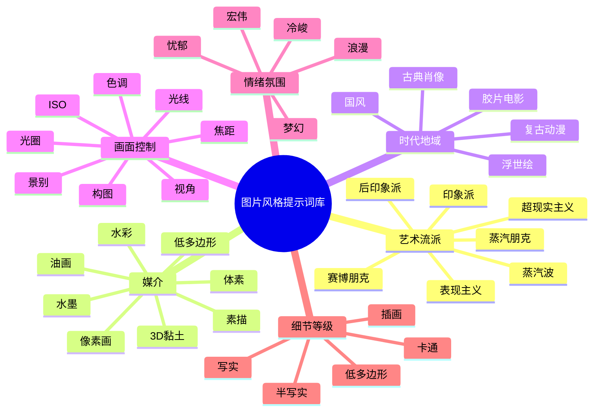

# 图片风格合集提示词库研究报告

## 执行摘要

本报告面向通用文生图模型，目标是把“图片风格”提示词从零散的经验词，整理成可直接复用的分类体系、参数表和可复制模板。综合官方文档、中文官方文档、主流社区实现文档与研究论文后，可以得到一个较稳定的结论：高质量风格提示词通常不是“堆词”，而是按**主体—场景—主风格—媒介—构图/镜头—光线/色彩—情绪—细节—否定词—平台参数**的顺序分层组织；其中风格控制的关键并不只在“风格名”，还在于媒介、时代地域、镜头、光线和细节等级这些次级控制项。阿里云文生图指南给出“主体+场景+风格”与“主体描述+场景描述+风格+镜头语言+氛围词+细节修饰”的公式，Stability AI 的 SD3.5 指南则把 style、subject/action、composition/framing、lighting/color、technical parameters、text、negative prompting 列为核心要素；Midjourney 官方进一步把 artistic mediums、time periods、emotions、colors、environments 拆成可单独检索的提示维度。citeturn22view0turn13view0turn21view0

在平台层面，Stable Diffusion 类工作流更适合做细粒度权重控制与负向提示，AUTOMATIC1111 Wiki 明确支持 `()`/`[]` 加减权、`(text:1.4)` 数值权重、`BREAK` 分层以及 prompt editing；Midjourney 则强调参数后置，常用控制包括 `--ar`、`--s`、`--q`、`--c`、`--raw`、`--no`、`--v`、`--sref`、`--sw`；OpenAI 图像生成文档强调自然语言描述、`revised_prompt` 自动改写，以及 `size`、`quality`、`background` 等输出控制，而 DALL·E 3 历史接口还提供 `style=vivid|natural` 和 `quality=standard|hd`。因此，真正“通用”的风格库不应只给一套词，而应同时给出**平台映射规则**。citeturn15view2turn15view4turn18view4turn17view1turn17view2turn18view0turn18view1turn18view2turn9view1turn9view3turn20view0

本报告最终提供三类成果：一套风格分类框架；覆盖 20 种高频风格的风格库摘要表；一份可直接复制为 `.txt` 的提示词合集样例，其中每种风格都给出至少 5 个变体模板。风格定义与关键词优先参考官方文档和中文官方文档，权重与顺序建议则是基于这些文档与主流社区实现规则的编辑性归纳。citeturn14view0turn21view0turn13view0turn11view0turn23view0

## 研究范围与方法

本研究默认目标平台为通用文本到图像模型，不绑定单一底模；输出语言为中文，但模板中保留少量高稳定性的英文风格核词，以兼容 Stable Diffusion、Midjourney 与 OpenAI 图像模型的跨平台使用习惯。来源类型按优先级分为四类：**官方文档**（Midjourney、OpenAI、Stability AI）、**中文官方文档**（阿里云百炼、腾讯混元）、**主流社区实现文档**（AUTOMATIC1111 Wiki）以及**研究论文**。其中，官方文档优先用于参数、语法和平台差异；中文官方文档优先用于风格分类与提示词结构；社区实现文档优先用于权重语法与高级编辑；论文用于支持“提示结构可形式化”“情绪表达可通过提示优化”等分析结论。citeturn11view0turn14view0turn13view0turn20view0turn11view3turn23view0turn24view0

从风格覆盖看，腾讯混元官方预置风格已经囊括水墨、概念艺术、油画、梵高风、水彩、像素、厚涂、插图、剪纸、印象派、2.5D、古典肖像、黑白素描、赛博朋克、科幻、暗黑、3D、蒸汽波、日系动漫、唯美古风、复古动漫、游戏卡通手绘和写实等；Midjourney《Art of Prompting》又补充了浮世绘、黑光、版画、铅笔素描、水彩、像素、时间年代、情绪和配色等高频词；Stability AI 的 SD3.5 Prompt Guide 则强调 line art、watercolor、oil painting、surrealism、expressionism、product photography、3D art、voxel art 等可单独作为 style token 的类别。基于这些来源，本报告选取 20 种兼顾流派、媒介、地域时代、摄影和低多边形层级的高频风格进行系统化整理。citeturn14view0turn21view0turn13view0

## 风格分类体系与通用拼装法

下面的层级图概括了一个实用、可扩展的“图片风格提示词库”结构。它并不是按美术史单轴分类，而是按模型更容易理解的**控制维度**分类：流派、媒介、时代/地域、光影/色彩/构图/镜头、情绪、细节等级。这个维度设计与阿里云的“图像五大要素”和 Stability 的 prompt structure 是一致的。citeturn11view0turn13view0turn21view0



实际写 prompt 时，建议用“内容层—风格层—镜头层—质感层—排除层—平台参数层”的方法，而不是把所有风格词并排罗列。阿里云的进阶公式明确把“主体描述、场景描述、风格、镜头语言、氛围词、细节修饰”分层；Stability AI 也建议把 subject 放在前面，再依次添加 composition、lighting、technical parameters。对多数模型而言，**主题越靠前，遵循度越高；风格词越集中，风格越稳定；冲突风格越少，画面越一致**。citeturn22view0turn13view0turn24view0


一个可跨平台迁移的通用骨架可以写成：

```text
[主体/动作] + [场景/时代/地域] + [主风格] + [媒介/工艺] + [构图/景别/视角/焦距] + [光线/色彩] + [情绪/氛围] + [细节/材质/分辨率] + [否定词] + [平台参数]
```

对摄影与电影风格，焦距、光圈和 ISO 更像“摄影语义提示”而不是硬件级锁定参数。Aliyun 把微距、超广角、长焦、鱼眼列入镜头类型；Stability AI 把 bird’s eye view、close-up、crane shot、wide-angle shot、fish-eye lens 视为 technical parameters；Adobe 与 Nikon 的摄影教程说明短焦距带来更广视角，长焦距带来更窄视角；大光圈倾向浅景深，小光圈倾向深景深；低 ISO 更干净，高 ISO 更适合暗光但噪点更高。因此，在文生图中写 `24mm`、`35mm`、`85mm`、`f/1.8`、`f/8`、`ISO100`、`ISO1600`，通常是在向模型传达“画面气质和摄影关系”。citeturn11view0turn13view0turn27search0turn27search1turn27search2turn27search3

下表给出“分类维度—常用词—作用”的压缩版速查。

| 分类维度 | 常用控制词 | 主要作用 |
|---|---|---|
| 艺术流派 | impressionist, surrealist, expressionist, cyberpunk, vaporwave | 决定整体审美语言 |
| 媒介 | oil painting, watercolor, ink wash, pencil sketch, pixel art, voxel art | 决定笔触、材质、边缘与颗粒 |
| 时代/地域 | ukiyo-e, art deco, classical portrait, retro anime, Chinese ink style | 决定历史语汇、服饰与装饰形态 |
| 光线/色彩 | backlight, rim light, dynamic shadows, neon, pastel, sepia, duotone | 决定情绪、层次与色调 |
| 构图/镜头 | close-up, wide-angle, bird’s-eye view, macro, 35mm, 85mm, symmetrical composition | 决定视角、空间压缩与叙事 |
| 情绪/氛围 | dreamy, lonely, majestic, tense, romantic, eerie | 决定故事性与情感基调 |
| 细节等级 | photorealistic, semi-realistic, stylized, cartoon, low poly | 决定真实度与复杂度 |

上表所列维度与词汇来源于阿里云提示词公式、Stability SD3.5 Prompt Guide、Midjourney《Art of Prompting》及腾讯混元的官方风格清单；“作用”一栏为基于这些文档的整理性归纳。citeturn11view0turn13view0turn21view0turn14view0

## 平台参数与提示词优化技巧

在平台语法上，最重要的不是“哪个平台更强”，而是“哪个平台允许哪种控制”。Stable Diffusion 系工作流通常分成正向 prompt 与负向 prompt，两者适合做精细加减权；AUTOMATIC1111 支持 `(word)`、`((word))`、`(word:1.5)`、`[word]`、`BREAK` 和 `[from:to:when]` 之类的高级语法。Midjourney 将参数严格放在 prompt 末尾，官方明确要求参数后置、前面留空格、且不要在参数里加标点；常见控制包括 `--ar`、`--s`、`--q`、`--c`、`--raw`、`--no`、`--sref`、`--sw` 与 `--v`。OpenAI 图像文档则更偏“自然语言+输出选项”，支持 `size`、`quality`、`background`，并会自动生成 `revised_prompt`；DALL·E 3 历史 API 还支持 `quality=standard|hd`、`style=vivid|natural` 与固定的 1024 方图/横图/竖图尺寸。citeturn15view2turn15view4turn18view4turn17view0turn17view1turn17view2turn18view0turn18view1turn18view2turn9view1turn9view3turn20view0

| 平台 | 适合控制点 | 常用语法/参数 | 实务建议 |
|---|---|---|---|
| Stable Diffusion / A1111 | 精细权重、负向词、分层、局部风格替换 | `(style:1.4)`、`[style]`、`negative_prompt`、`BREAK`、`[from:to:0.5]` | 适合做风格强度微调与排错 |
| Midjourney | 画幅、风格强度、随机度、参考风格、负向排除 | `--ar`、`--s`、`--q`、`--c`、`--raw`、`--no`、`--sref`、`--sw`、`--v` | 适合快速出审美统一的成图 |
| OpenAI GPT Image / DALL·E | 自然语言遵循、文字渲染、尺寸与质量控制 | `size`、`quality`、`background`；DALL·E 3 的 `style=vivid|natural`、`quality=hd` | 适合中文长描述、排版文字与多轮改写 |

表中 Stable Diffusion 语法来自 AUTOMATIC1111 Wiki；Midjourney 参数来自官方 Parameter List、Aspect Ratio、Stylize、Quality、Chaos、No、Raw 与 Style Reference；OpenAI 行来自 OpenAI Developers 文档与 DALL·E 3 Help 文档。citeturn15view0turn15view2turn15view4turn18view4turn17view0turn17view1turn17view2turn18view0turn18view1turn18view2turn9view1turn9view3turn20view0

风格优化真正有效的方法，通常有四个。第一，**控制风格强度**：在 SD 中提高主风格到 `1.3–1.6`，媒介词保持 `1.1–1.3`，次风格不宜超过主风格；在 Midjourney 中优先通过 `--s` 与 `--sw` 调节强度，低 `--s` 更贴 prompt，高 `--s` 更有模型审美；摄影风格则常配合 `--raw` 降低自动美化。第二，**避免风格冲突**：Midjourney 官方在 Style Reference 中明确建议“保持文本简单，避免加入与参考图冲突的风格词”，并强调“描述内容，不要写如何修改参考图”；这条原则完全可以扩展到无参考图写法，即尽量只保留一个主风格和一个媒介词。第三，**善用否定词**：A1111 可直接用负向词字段，Midjourney 用 `--no` 或负权重，且官方说明 `--no` 等价于 `-0.5` 的负向权重。第四，**分层提示**：A1111 的 `BREAK` 与 prompt editing 适合做前后阶段切换，例如从 fantasy 逐步切到 cyberpunk。citeturn17view1turn18view3turn18view2turn25view0turn16view0turn16view1turn18view1turn15view0turn15view4

下面给出三套最常用的权重写法示例。它们不是唯一正确答案，但与官方语法完全兼容，且便于迁移：

```text
SD/A1111
[主体], (cyberpunk:1.5), (neon rim light:1.3), rainy street, 35mm, cinematic composition, [watercolor], negative_prompt: blurry, low detail, text, watermark

Midjourney
[主体]::1.2 cyberpunk::1.5 neon rim light::1.2 rainy street::1.0 35mm cinematic still --ar 16:9 --s 350 --c 15 --q 1 --no text, watermark

OpenAI / GPT Image
生成一张[主体]在雨夜街头的画面，主风格为赛博朋克，但不要过度夸张；突出霓虹边缘光、35mm电影感构图和湿润地面反射；避免文字、水印、低细节和多余背景元素。
```

摄影语义值可以这样理解：`24mm` 更适合夸张空间和环境广角，`35mm` 常用于纪实和电影感中景，`50mm` 更中性，`85mm` 常与人像压缩感和背景虚化联系在一起；`f/1.8` 常被模型理解为浅景深和主体突出，`f/8` 更偏全景清晰；`ISO100` 更偏干净、受控棚拍，`ISO1600` 更偏暗光、颗粒和纪实感。这些语义虽然不是所有模型的“硬锁定”，但在写实摄影、商业摄影和胶片电影三类风格中非常有效。citeturn11view0turn27search0turn27search1turn27search2turn27search3

## 风格提示词库

下列风格库覆盖 20 种高频风格。风格名、典型关键词与部分媒介/年代/情绪用词，优先综合自腾讯混元官方风格清单、Midjourney《Art of Prompting》、Stability SD3.5 Prompt Guide 与阿里云 Prompt 指南；“定义”与“推荐权重/顺序”是面向实操的编辑性整理，重点不是学术上的严格美术史定义，而是“能让模型稳定出图”的提示词抽象。citeturn14view0turn21view0turn13view0turn11view0

| 风格 | 维度 | 定义 | 典型关键词 | 常见参数与推荐权重/顺序 |
|---|---|---|---|---|
| 印象派 | 流派 | 以光色瞬间感、碎笔触、户外写生为核心 | impressionist, plein air, broken brushstrokes, soft sunlight, pastel palette | SD 主风格 `1.4`；MJ `--s 200-450`；顺序：主体→场景→印象派→光色 |
| 后印象派 | 流派 | 比印象派更强调结构、主观色彩与厚涂 | post-impressionism, van gogh style, impasto, swirling strokes | SD `1.5`；MJ `--s 300-650`；厚涂词放在风格后 |
| 超现实主义 | 流派 | 梦境逻辑、违和物体组合、象征性空间 | surrealism, dreamlike, impossible architecture, symbolic objects | SD `1.5-1.7`；MJ `--c 15-40`、`--s 250-600` |
| 表现主义 | 流派 | 强烈情绪与变形、对比色和张力线条 | expressionism, distorted forms, emotional color, dramatic contrast | SD `1.4-1.6`；MJ `--s 250-500` |
| 赛博朋克 | 流派 | 高科技/低生活、霓虹、雨夜、金属密度高 | cyberpunk, neon, rainy street, hologram, futuristic city | SD `1.5`；MJ `--ar 16:9`, `--s 250-600`, `--c 10-25` |
| 蒸汽朋克 | 流派 | 维多利亚时代机械想象、铜管齿轮、蒸汽 | steampunk, brass, gears, victorian, steam, leather | SD `1.4`；MJ `--s 150-400`；时代词放在风格前 |
| 蒸汽波 | 流派/配色 | 80s/90s 数字怀旧、粉青霓虹、网格与雕像 | vaporwave, retro grid, magenta cyan, synthwave, marble bust | SD `1.4`；MJ `--s 250-500`；色调词单独强化 |
| 水墨国风 | 地域/媒介 | 东方留白、墨韵、宣纸肌理、国风服饰或山水 | ink wash, Chinese ink style, xuan paper, misty mountains | SD `1.4-1.6`；MJ `--s 100-350`；光色宜简洁 |
| 浮世绘 | 地域/版画 | 日式木版画感、平涂色块、装饰边界强 | ukiyo-e, woodblock print, flat color, Japanese pattern | SD `1.4`；MJ `--s 150-350` |
| 古典肖像 | 时代 | 古典油画人物、三分之四侧身、明暗塑形 | classical portrait, chiaroscuro, baroque lighting, formal pose | SD `1.3-1.5`；MJ `--s 120-300`；姿态和灯光非常关键 |

上表前十项偏“强风格流派”，通常适合把主风格放在 prompt 前半段，并只保留一个主流派与一个媒介词，防止风格打架。腾讯混元、Midjourney 与 Stability AI 的官方示例都支持把流派当成核心标签；Aliyun 则强调镜头语言、氛围词和光线是提升风格辨识度的关键辅助项。citeturn14view0turn21view0turn13view0turn22view0turn22view2

| 风格 | 维度 | 定义 | 典型关键词 | 常见参数与推荐权重/顺序 |
|---|---|---|---|---|
| 油画写实 | 媒介 | 以油彩厚度、画布纹理和写实塑形为主 | oil painting, canvas texture, impasto, realistic brushwork | SD `1.3`；MJ `--s 120-250`；材质词紧跟媒介 |
| 水彩 | 媒介 | 通透水痕、边缘渗化、轻快纸感 | watercolor, translucent wash, bleeding edges, soft pigment | SD `1.4`；MJ `--s 150-300` |
| 铅笔素描 | 媒介 | 石墨线条、交叉排线、纸面颗粒 | pencil sketch, graphite, cross-hatching, monochrome | SD `1.3`；MJ `--s 100-220`；色彩词尽量少 |
| 摄影写实 | 细节等级 | 强调真实镜头感、材质可信与自然皮肤/光线 | photorealistic, realistic photography, natural skin texture | SD `1.1-1.3`；MJ `--raw --s 0-150`；镜头词前置 |
| 胶片电影 | 时代/摄影 | 电影剧照、胶片颗粒、色彩分级和叙事构图 | cinematic still, 35mm film, film grain, color grading | SD `1.2-1.4`；MJ `--raw --ar 21:9 --s 50-250` |
| 产品商业摄影 | 摄影 | 白底/控光/高锐度，强调卖点与材质 | product photography, studio lighting, high key, ISO100, f/11 | SD `1.1-1.2`；MJ `--raw --s 0-100`；先产品后布光 |
| 日系动漫 | 卡通化 | 面部简化、轮廓清晰、配色鲜明、角色感强 | anime, cel shading, clean lineart, vibrant color | SD `1.4-1.6`；MJ 可用 `--niji` |
| 复古动漫 | 时代/卡通 | 70s-90s 动画赛璐珞、旧纸感与颗粒色偏 | retro anime, cel animation, halftone, vintage color | SD `1.4`；MJ `--niji` + 复古色词 |
| 像素画 | 像素等级 | 低分辨率点阵、有限色板、游戏资产感 | pixel art, 16-bit, limited palette, sprite, tile set | SD `1.5`；MJ `--s 80-220`；避免“photorealistic” |
| 低多边形/体素 | 细节等级 | 几何面块或方块体构成，抽象化强 | low poly, geometric facets, voxel art, simplified forms | SD `1.4`；MJ `--s 100-250`；形体词优先 |

后十项偏“媒介/真实度/卡通化等级”。这类风格的主控制点往往不是世界观型流派，而是**材质和边缘处理**。因此推荐把“媒介/真实度”放在流派词前后的一组核心位置，例如 `photorealistic, studio lighting`、`watercolor, bleeding edges`、`pixel art, limited palette`，而不要把它们埋在 prompt 尾部。该建议与 Stability AI 的 style+composition+lighting 结构，以及 Aliyun 的“风格+镜头语言+细节修饰”一致。citeturn13view0turn22view0turn21view0

## 可复制合集样例

下面是一份适合直接保存为 `.txt` 的提示词合集样例。写法采用“中文意图 + 英文风格核词”的混合形式，以提高跨模型兼容性。若用于 SD/A1111，可把组标题里的 `SD权重建议` 直接改写进 prompt；若用于 Midjourney，可把权重逻辑改写成 `::` 或通过 `--s/--sw/--raw/--no` 调节；若用于 OpenAI 图像模型，则建议保留主体与场景描述，用自然语言表达“主风格强、次风格弱、避免什么”。这些样例遵循上文的分层公式和平台规则。citeturn22view0turn13view0turn15view2turn16view0turn18view4turn9view3

```txt
[印象派]
# SD权重建议：(impressionist:1.4), (plein air:1.1) | MJ建议：--ar 3:4 --s 300
1. [主体]，印象派，impressionist, broken brushstrokes, plein air, pastel palette, soft morning light, garden background, half-body portrait
2. [主体]在[场景]，impressionist landscape, shimmering light, loose strokes, atmospheric haze, spring colors
3. [建筑主体]，impressionist city view, wet street reflections, soft dusk light, painterly texture, elegant composition
4. [产品/静物]，impressionist still life, floral table, soft daylight, pastel tones, visible brushwork
5. [主体]海报，impressionist poster style, luminous color spots, dreamy atmosphere, soft contrast, painterly finish

[后印象派]
# SD权重建议：(post-impressionism:1.5), (impasto:1.3) | MJ建议：--ar 4:5 --s 450
1. [主体]，post-impressionism, van gogh style, thick impasto, swirling strokes, dramatic sky, warm yellow blue contrast
2. [主体]在夜晚[场景]，post-impressionist night scene, expressive color blocks, textured brushwork, dynamic lines
3. [建筑主体]，van gogh inspired architecture, swirling clouds, thick paint, intense cobalt and gold
4. [静物主体]，post-impressionist still life, bold outlines, saturated pigments, canvas texture, emotional color
5. [主体]海报，van gogh inspired poster, impasto texture, exaggerated rhythm, gallery lighting

[超现实主义]
# SD权重建议：(surrealism:1.6), (dreamlike:1.2) | MJ建议：--ar 16:9 --s 450 --c 25
1. [主体]，surrealism, dreamlike space, symbolic objects, impossible scale, floating elements, cinematic shadows
2. [主体]在沙漠[场景]，surrealist landscape, giant moon, melting forms, long shadows, uncanny silence
3. [建筑主体]，surreal architecture, impossible stairs, mirror pools, soft twilight, symbolic composition
4. [产品主体]，surreal product ad, levitating object, impossible reflection, luxury mood, high contrast
5. [主体]海报，surrealist poster, theatrical composition, dream symbolism, dramatic negative space

[表现主义]
# SD权重建议：(expressionism:1.5), (emotional color:1.2) | MJ建议：--ar 3:4 --s 380
1. [主体]，expressionism, distorted forms, emotional color, sharp brushwork, tense composition, dramatic contrast
2. [主体]在室内[场景]，expressionist interior, angular shapes, red blue clash, anxious atmosphere
3. [建筑主体]，expressionist cityscape, tilted perspective, intense shadow blocks, stormy mood
4. [静物主体]，expressionist still life, dramatic contour, high saturation, emotional brush marks
5. [主体]海报，expressionist poster, graphic contrast, emotional exaggeration, stage-like lighting

[赛博朋克]
# SD权重建议：(cyberpunk:1.5), (neon rim light:1.3) | MJ建议：--ar 16:9 --s 350 --c 15 --no text
1. [主体]，cyberpunk, neon signs, rainy night street, holograms, reflective pavement, 35mm cinematic still
2. [主体]在高楼街区，cyberpunk cityscape, magenta cyan neon, wet asphalt, dense cables, futuristic atmosphere
3. [建筑主体]，cyberpunk architecture, giant billboards, fog, glowing windows, low-angle view
4. [产品主体]，cyberpunk product shot, dark studio, neon edge light, chrome reflections, premium sci-fi look
5. [主体]海报，cyberpunk poster, high-tech low-life mood, holographic UI, dramatic backlight

[蒸汽朋克]
# SD权重建议：(steampunk:1.4), (brass gears:1.2) | MJ建议：--ar 4:5 --s 260
1. [主体]，steampunk, brass gears, leather straps, victorian costume, warm workshop light, intricate machinery
2. [主体]在飞艇港口，steampunk adventure scene, steam pipes, copper textures, sepia tone, cinematic framing
3. [建筑主体]，steampunk factory, giant clockwork tower, smoke, rivets, victorian engineering
4. [产品主体]，steampunk gadget ad, brass body, cog details, dramatic tabletop lighting, museum quality
5. [主体]海报，steampunk poster, antique typography mood, brass ornament, copper glow, heroic pose

[蒸汽波]
# SD权重建议：(vaporwave:1.4), (magenta cyan:1.3) | MJ建议：--ar 1:1 --s 320
1. [主体]，vaporwave, retro grid, magenta cyan palette, sunset gradient, marble bust, nostalgic digital haze
2. [主体]在虚拟海滩，vaporwave landscape, chrome sun, palm trees, broken VHS texture, synthwave mood
3. [建筑主体]，vaporwave architecture, mirrored floor, neon horizon, pastel twilight, retro-futuristic mood
4. [产品主体]，vaporwave product ad, chrome reflections, pastel background, 80s digital nostalgia
5. [主体]海报，vaporwave poster, Japanese text mood, grid floor, pink blue glow, album cover style

[水墨国风]
# SD权重建议：(ink wash:1.5), (Chinese ink style:1.2) | MJ建议：--ar 9:16 --s 220
1. [主体]，ink wash, Chinese ink style, xuan paper texture, misty mountains, restrained palette, elegant atmosphere
2. [主体]在山水之间，Chinese ink landscape, flowing mist, layered mountains, poetic empty space
3. [建筑主体]，ancient pavilion, ink wash, rain and bamboo, monochrome elegance, vertical composition
4. [静物主体]，Chinese ink still life, delicate brush rhythm, subtle gray scale, refined calmness
5. [主体]海报，guofeng ink style, minimal composition, seal-like red accent, poetic mood

[浮世绘]
# SD权重建议：(ukiyo-e:1.4), (woodblock print:1.2) | MJ建议：--ar 2:3 --s 220
1. [主体]，ukiyo-e, woodblock print, flat colors, bold outlines, patterned kimono, decorative waves
2. [主体]在海边[场景]，ukiyo-e landscape, stylized clouds, layered waves, crisp contour
3. [建筑主体]，Japanese town in ukiyo-e style, flat perspective, ornamental detail, muted color blocks
4. [产品主体]，ukiyo-e inspired package illustration, flat pattern, print texture, elegant frame
5. [主体]海报，ukiyo-e poster, bold contour, ornamental border, traditional print aesthetics

[古典肖像]
# SD权重建议：(classical portrait:1.4), (chiaroscuro:1.2) | MJ建议：--ar 4:5 --s 180
1. [主体]，classical portrait, chiaroscuro, formal pose, baroque lighting, oil canvas texture, museum quality
2. [主体]三分之四侧身，classical portrait painting, dark background, noble costume, soft skin gradation
3. [主体]半身像，old master portrait, realistic oil paint, dramatic shadow, elegant hand gesture
4. [主体]在室内，classical portrait with window light, muted palette, dignified atmosphere, fine brushwork
5. [主体]海报，museum portrait style, gold frame mood, baroque lighting, refined realism

[油画写实]
# SD权重建议：(oil painting:1.3), (canvas texture:1.1) | MJ建议：--ar 3:4 --s 180
1. [主体]，oil painting, realistic brushwork, canvas texture, balanced lighting, rich color depth
2. [主体]在[场景]，realistic oil landscape, natural sky, textured strokes, calm atmosphere
3. [建筑主体]，oil painting architecture, controlled perspective, warm highlights, painterly realism
4. [静物主体]，oil painting still life, subtle reflections, realistic material rendering, soft shadows
5. [主体]海报，oil painted poster, premium gallery finish, realistic paint texture

[水彩]
# SD权重建议：(watercolor:1.4), (translucent wash:1.2) | MJ建议：--ar 3:4 --s 220
1. [主体]，watercolor, translucent wash, soft pigment bloom, white paper texture, delicate edges
2. [主体]在花园，watercolor illustration, light bleeding edges, airy color, spring freshness
3. [建筑主体]，watercolor cityscape, light sketch lines, soft atmospheric perspective, pastel tone
4. [产品主体]，watercolor packaging illustration, fluid pigments, soft contour, clean negative space
5. [主体]海报，watercolor poster, gentle palette, paper grain, elegant artistic finish

[铅笔素描]
# SD权重建议：(pencil sketch:1.3), (graphite:1.2) | MJ建议：--ar 3:4 --s 120
1. [主体]，pencil sketch, graphite shading, cross-hatching, monochrome, paper grain, clean contour
2. [主体]肖像，graphite portrait, sharp eyes, subtle shading, white background
3. [建筑主体]，architectural pencil drawing, precise lines, perspective construction, technical elegance
4. [静物主体]，pencil still life, controlled hatching, soft shadow, realistic proportions
5. [主体]海报，graphite poster style, monochrome drama, strong line hierarchy

[摄影写实]
# SD权重建议：(photorealistic:1.2), (natural light:1.1) | MJ建议：--raw --ar 3:4 --s 80
1. [主体]，photorealistic, realistic photography, natural skin texture, 50mm lens, soft daylight, high detail
2. [主体]在[场景]，photorealistic scene, accurate materials, balanced exposure, documentary realism
3. [建筑主体]，architectural photography, 24mm lens, realistic texture, clear daylight, precise geometry
4. [产品主体]，clean product photography, studio realism, sharp details, realistic shadow, white backdrop
5. [主体]海报，photorealistic poster, premium realism, crisp details, believable light

[胶片电影]
# SD权重建议：(cinematic still:1.3), (film grain:1.1) | MJ建议：--raw --ar 21:9 --s 120
1. [主体]，cinematic still, 35mm film, film grain, color grading, moody lighting, shallow depth of field
2. [主体]在夜晚[场景]，movie still, anamorphic mood, practical lights, dramatic composition, shadow detail
3. [建筑主体]，cinematic architecture shot, dusk sky, controlled highlights, widescreen framing
4. [产品主体]，cinematic ad shot, hero lighting, subtle film grain, premium atmosphere
5. [主体]海报，festival poster style, cinematic still, bold grading, narrative tension

[产品商业摄影]
# SD权重建议：(product photography:1.2), (studio lighting:1.2) | MJ建议：--raw --ar 1:1 --s 50
1. [产品主体]，product photography, studio lighting, clean background, ISO100, f/11, sharp focus, premium commercial look
2. [产品主体]白底，high key product shot, shadow control, crisp edges, catalog quality
3. [产品主体]黑底，luxury product photography, rim light, reflective surface, polished texture
4. [产品主体]在场景化台面，lifestyle product shot, soft window light, premium branding mood
5. [产品主体]海报，commercial key visual, bold hero angle, controlled reflections, ad campaign finish

[日系动漫]
# SD权重建议：(anime:1.5), (clean lineart:1.2) | MJ建议：--niji --ar 2:3
1. [主体]，anime, clean lineart, cel shading, expressive eyes, vibrant color, dynamic pose
2. [主体]在校园[场景]，anime scene, soft sunlight, clear contour, lively atmosphere
3. [建筑主体]，anime city background, crisp perspective, bright palette, stylized detail
4. [产品/道具主体]，anime illustration, clean silhouette, color separation, polished line quality
5. [主体]海报，anime poster, dramatic action pose, speed lines, bold composition

[复古动漫]
# SD权重建议：(retro anime:1.4), (cel animation:1.2) | MJ建议：--niji --ar 4:5
1. [主体]，retro anime, cel animation, vintage color drift, halftone texture, nostalgic frame
2. [主体]在80年代城市，retro anime background, muted neon, old TV tone, classic cel look
3. [建筑主体]，retro animation cityscape, limited palette, soft film grain, nostalgic mood
4. [产品/道具主体]，retro anime prop sheet, cel shaded, aged paper tone, clean contour
5. [主体]海报，80s anime poster, halftone shadows, vintage print feeling, classic composition

[像素画]
# SD权重建议：(pixel art:1.5), (limited palette:1.2) | MJ建议：--ar 1:1 --s 150
1. [主体]，pixel art, 16-bit, limited palette, sprite style, crisp pixels, game asset look
2. [主体]在森林[场景]，pixel art landscape, tile-based background, retro RPG mood
3. [建筑主体]，pixel art city, night palette, tiny windows, clean tile structure
4. [产品/道具主体]，pixel art item icon, centered composition, readable silhouette, 32x32 style
5. [主体]海报，retro game cover, pixel art, bold title space, arcade atmosphere

[低多边形/体素]
# SD权重建议：(low poly:1.4) 或 (voxel art:1.4) | MJ建议：--ar 1:1 --s 180
1. [主体]，low poly, geometric facets, simplified forms, clean color blocks, studio background
2. [主体]在自然[场景]，low poly landscape, faceted mountains, stylized trees, clear lighting
3. [建筑主体]，voxel architecture, block-based forms, isometric feeling, clean edges
4. [产品主体]，low poly product render, geometric highlight, minimal shadow, 3D illustration look
5. [主体]海报，voxel poster style, blocky shapes, playful composition, stylized 3D look
```

如果希望把这份样例进一步扩展成你自己的长期提示词库，最推荐的方式不是继续“增加词量”，而是给每一行 prompt 增加字段化槽位，例如：`主题`、`动作`、`地域/时代`、`主风格`、`媒介`、`镜头`、`光线`、`色调`、`情绪`、`细节等级`、`负向词`、`平台后缀`。论文研究显示，文生图 prompt 具备可形式化的结构，而情绪与表达精度也确实会随着更明确、更分层的编辑而提升。citeturn23view0turn24view0

## 结论

把“图片风格合集提示词库”做成真正可复用的工具，关键不在于收集更多华丽的风格名，而在于建立一套稳定的**提示词语法**。从本次研究看，最稳妥的方法是：先锁定主体与场景，再指定单一主风格，再用媒介、镜头、光线、色调和情绪去“雕刻”风格；需要强风格时，用显式权重和平台参数加压；需要写实时，用 `--raw`、低 stylize、自然光和简洁风格词减压；需要排错时，用否定词、负权重或分层编辑逐步收敛。这个方法同时得到了中文官方文档、英文官方文档与主流社区实现文档的支持。citeturn22view0turn13view0turn18view3turn16view1turn15view0turn15view4

如果只保留一句最重要的实务结论，那就是：**一个好用的风格提示词库，应该把“风格名”视为主键，把“媒介、镜头、光线、色调、细节等级、否定词、平台参数”视为索引。** 这样整理出来的词库，才既能复制粘贴，又能扩展、版本化，并跨 Stable Diffusion、Midjourney、OpenAI 图像模型等平台迁移。官方文档对参数规则、中文官方文档对提示结构、社区实现文档对权重语法的分工非常清晰；把三者合并，就是一份真正可用的技术手册级风格库。citeturn18view4turn11view0turn14view0turn11view3turn20view0