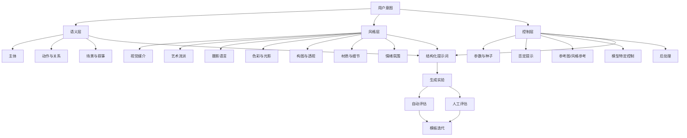
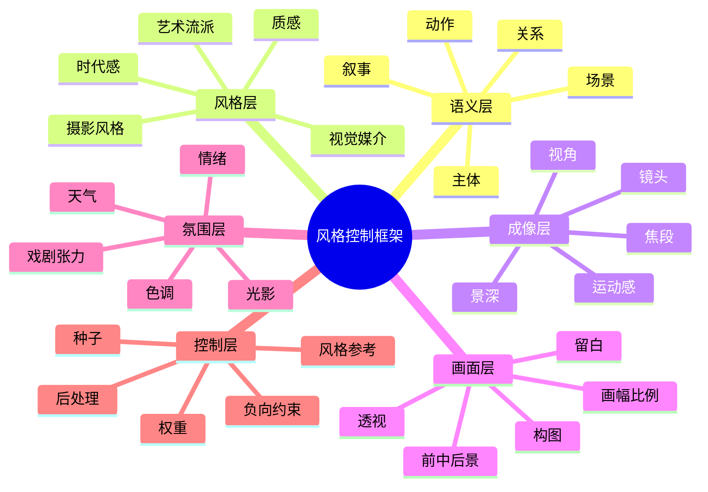

# 提示词工程中的风格控制研究

## 执行摘要

提示词工程在图像生成中的核心，不是“堆砌华丽词藻”，而是把用户意图分解为一组可控的视觉变量，再按模型支持的控制接口重新组织出来。综合 Google Imagen 官方中文提示指南、Midjourney 官方 Prompt Basics 与 Style Reference 文档、Stability AI 官方参数文档，以及 OpenAI 当前图像生成文档，可以把画面风格控制稳定拆成八类要素：**主体、背景与环境、视觉媒介与艺术流派、摄影/镜头语言、色彩与光影、构图与透视、材质与细节、情绪与叙事**。其中，Imagen 官方明确建议从“主体—背景—风格”入手，并继续加入摄影修饰符、材料、历史艺术参考、质量修饰符与宽高比；Midjourney 官方则把控制点明确到 Subject、Medium、Environment、Lighting、Color、Mood、Composition，并提供 style reference、raw、stylize、seed、permutations 等专门控制接口。citeturn8view3turn9view0turn9view1turn9view2turn9view3turn16view0turn16view1turn17view0turn17view2turn17view4

不同主流模型对“风格控制”的暴露深度差异很大。Stability/Stable Diffusion 生态最适合做**低层参数实验**，因为官方 API 与历史接口公开了 seed、negative prompt、style preset、cfg_scale、strength、steps、sampler 等控制项，且 Stability 还提供 Style Guide 与 Style Transfer 这种“用参考图抽取风格”的官方能力。Midjourney 则是**高层风格探索**最强：style reference 不复制对象而复制整体风格，`--sw`、`--sv`、`--stylize`、`--raw`、`--seed`、`--chaos`、`::` 权重、permutations 共同构成一套非常适合风格试验的界面。OpenAI 当前主路线已经是 GPT Image 系列，文档重点在自然语言描述、多轮编辑、自动 revised prompt、尺寸/质量/背景/格式等输出控制；DALL·E 3 仍可用，但已被官方标记为 deprecated。Google Imagen/Vertex AI 在 2026 年文档层面已提示其服务迁移到 Gemini Enterprise Agent Platform，同时保留了 prompt guide、aspect ratio、enhancePrompt、language、sampleCount、seed、safety/person 设定等一整套参数。citeturn18search0turn27search4turn3search0turn16view1turn17view0turn17view2turn17view3turn17view4turn10view0turn10view2turn30search0turn30search1turn14view2turn14view3turn28search0turn9view4turn9view5

就方法论而言，最稳妥的做法不是一次性写“终极提示词”，而是建立**分层提示结构**与**多变量实验设计**。官方文档与原始研究共同支持这一点：Imagen 强调从基础提示迭代加细节；Midjourney 鼓励短而清晰的提示，并用参数做附加控制；Prompt-to-Prompt 说明文本中词级替换会通过 cross-attention 显著改变布局与语义映射；Promptist 与用户研究进一步表明，高质量提示通常是模型偏好的“中间语言”，与普通用户自然表达并不完全相同。citeturn8view3turn16view0turn19academia1turn25academia0turn25academia1turn25academia3

评估方面，仅靠“好不好看”远远不够。当前较可靠的研究组合是：用 **CLIPScore** 与生成图像反向描述做语义保真度检查，用 **GenEval** 与 **T2I-CompBench** 测对象计数、颜色绑定、空间关系和组合语义，用 **ImageReward** 与 **PickScore** 近似人类偏好，用 **LPIPS** 测同提示多样性；若有大规模真实参考分布，可补充 **FID**，但需要注意后续研究已明确指出 FID 对现代文本到图像评估存在表示偏差与样本复杂度问题。citeturn19academia0turn21academia0turn20academia1turn20academia0turn20academia2turn22academia0turn31academia3turn31academia1

这份报告的结论是：**风格可控性不应被理解为“多写风格词”，而应被理解为“管理多层视觉变量与模型原生控制接口的对应关系”**。真正可复用的提示方案，必须同时包含：结构化分解、模型适配、参数实验、负向约束、评价协议与示例模板。citeturn8view3turn16view0turn18search0turn28search0

## 研究方法论

本报告采用“**官方文档优先，原始论文补强，经验模板后置**”的方法。第一层材料是各平台官方提示与 API 文档，包括 Midjourney 官方提示文档、OpenAI 图像生成与 DALL·E 文档、Google Imagen 官方中文提示指南与 API 参考、Stability AI 官方 API 参数与 Style Guide/Style Transfer 文档；第二层材料是原始学术文献，包括 Latent Diffusion、SDXL、Imagen、DALL·E 2、Prompt-to-Prompt、CLIPScore、GenEval、T2I-CompBench、ImageReward、PickScore、LPIPS、FID 等。这样做的目的，是把“平台当前支持什么”与“研究上如何评价和解释这些现象”严格区分开来。citeturn24academia3turn24academia2turn24academia1turn24academia0turn19academia1turn19academia0turn21academia0turn20academia1turn20academia0turn20academia2turn22academia0turn31academia3

从方法设计上，本报告把提示词工程拆成三层。第一层是**语义层**，即“我要生成什么”，包括主体、动作、关系、场景与叙事。第二层是**风格层**，即“它看起来像什么”，包括媒介、艺术流派、摄影语言、色彩、光线、材质、质感与时代感。第三层是**控制层**，即“如何让模型更稳定地照做”，包括 seed、CFG 或权重、否定提示、style reference、aspect ratio、quality、raw/stylize、prompt rewriting、后处理等。这个三层划分与 Imagen 的“主体—背景—风格”起点、Midjourney 的多维提示组织、Stability 的参数/API 设计以及 OpenAI/Imagen 的 prompt rewrite 机制是兼容的。citeturn8view3turn16view0turn16view1turn18search0turn27search4turn10view2turn28search0

在研究产出上，我将“可复用模板”放在后面，而不是先给模板再解释。原因是提示模板如果脱离变量框架，往往只能复用表层词汇，难以跨模型迁移；而一旦先明确变量框架，再写模板，就可以让同一模板在 Stable Diffusion、Midjourney、GPT Image/DALL·E、Imagen 中分别映射到不同的控制方式。用户研究与日志研究都表明，文本到图像系统中的提示常常比普通搜索查询更长、更结构化，并呈现明显的迭代修改模式；这意味着真正有价值的不是“单次最好提示”，而是“可演化提示系统”。citeturn25academia0turn25academia3turn25search4

下面这张图概括了本文的方法框架。其结构来自官方提示指南与可控生成研究的综合抽象。citeturn8view3turn16view0turn19academia1

## 官方指南与主流模型能力对照

从 2026 年当前文档看，主流平台已经分化为两种路线：一类是 **Stable Diffusion / Midjourney** 这种偏“显式参数与风格接口”的系统；另一类是 **GPT Image / DALL·E / Imagen** 这种偏“自然语言 + 平台内置提示优化”的系统。二者并不是谁高谁低，而是把控制权分配给用户与系统的方式不同。citeturn18search0turn16view1turn10view2turn28search0

| 模型与平台 | 官方提示核心 | 官方风格控制接口 | 当前文档信号 |
|---|---|---|---|
| Stability AI / Stable Diffusion 生态 | 当前 Stable Image Core 强调“no prompt engineering required”，但 API 同时暴露 prompt、negative prompt、seed、style preset、cfg_scale、strength 等可控项 | `style_preset`、`negative_prompt`、`seed`、`cfg_scale`、`strength`，另有 Style Guide、Style Transfer | 适合做**低层参数实验**与风格参考实验 |
| Midjourney | 官方明确建议“short and simple prompts”；同时要求把参数放在提示末尾 | `--ar`、`--seed`、`--raw`、`--stylize`、`--sref`、`--sw`、`--sv`、`--no`、`::` 权重、permutations | 适合做**高层风格探索与批量变体试验** |
| OpenAI GPT Image | 文档强调自然语言生成、多轮编辑、自动 revised prompt、输出尺寸/质量/背景控制 | `size`、`quality`、`format`、`compression`、`background`、`action`；Responses API 自动改写提示 | 适合做**自然语言驱动的生成与编辑工作流** |
| DALL·E 3 | 官方强调复杂提示理解、自动扩写详细 prompt | `quality`=`standard/hd`，`style`=`vivid/natural`，固定高分辨率尺寸 | 仍可用，但官方已标记 deprecated |
| Google Imagen | 官方中文提示指南系统化最完整，建议从“主体—背景—风格”入手并逐步加摄影/材料/质量/宽高比信息 | `aspectRatio`、`sampleCount`、`sampleImageSize`、`enhancePrompt`、`language`、`seed`、`personGeneration`、`safetySetting`；旧模型支持 `negativePrompt` | 官方中文资料最适合做**结构化提示教学与实验设计** |

表中信息汇总自 Stability AI 官方 API 与 Style Guide 文档、Midjourney Prompt Basics / Parameter List / Style Reference、OpenAI 图像生成与 DALL·E 3 文档、Google Imagen 中文提示指南与 Imagen API 参考。citeturn18search0turn27search4turn16view0turn16view1turn17view0turn17view2turn30search0turn30search1turn14view2turn14view3turn14view4turn8view3turn9view0turn9view3turn28search0

### Stable Diffusion 与 Stability AI

Stability 当前官方口径有一个很值得注意的变化：**Stable Image Core 声称“不需要 prompt engineering”**，这说明其产品设计在尽量把复杂提示工程隐藏到后端；但对研究者来说，官方仍公开了足够多的参数来支持严格实验，包括 `negative_prompt`、`seed`、`style_preset`、`cfg_scale`、`strength`，以及图像到图像、Style Guide、Style Transfer 等接口。对于需要比较风格词、否定提示、随机种子与引导强度影响的研究，这仍然是最友好的官方环境之一。citeturn18search0turn27search4turn27search5turn3search0

在风格维度上，Stability 官方的 `style_preset` 枚举本身已经定义了一组可直接实验的风格标签，如 `analog-film`、`anime`、`cinematic`、`comic-book`、`digital-art`、`fantasy-art`、`isometric`、`line-art`、`low-poly`、`neon-punk`、`origami`、`photographic`、`pixel-art`。这比社区“魔法词”更适合做可重复对照实验。若你的目标是研究“风格词本身的效应”，建议把 `style_preset` 作为一个独立变量，而不是把所有风格都混在正文 prompt 里。citeturn18search0turn27search4

### Midjourney

Midjourney 的官方文档非常清楚地表达了一个原则：**提示应短、清晰、面向结果，而不是冗长指令**。它同时给出了最完整的风格探索入口：Prompt Basics 中把可控制维度明确为 Subject、Medium、Environment、Lighting、Color、Mood、Composition；Art of Prompting 页面又把艺术媒介、时代、情绪、颜色、环境做成了直观示例库；Style Reference 则进一步允许用户用参考图只迁移“整体视觉气质”，不复制人物或对象。citeturn16view0turn29view0turn17view5

对风格研究尤其关键的是 Midjourney 的几组参数：`--raw` 会降低平台自动风格化倾向，使输出更写实、更可控；`--sref`/`--sw`/`--sv` 提供风格参考与风格影响强度；`::` 权重和负权重允许做概念重加权与排除；permutations 能把同一模板一次展开成成组实验。换言之，Midjourney 虽然不像 Stable Diffusion 那样暴露 CFG 与 sampler，但它在“风格探索工作台”这一层面其实非常强。citeturn17view0turn17view2turn17view3turn17view4turn16view1

### OpenAI GPT Image 与 DALL·E

OpenAI 当前官方文档的重心已经明显转向 **GPT Image**。其文档强调两件事：一是可通过 Responses API 做多轮图像生成与编辑；二是系统会自动提供 `revised_prompt`，也就是平台会主动把你的输入改写成更有利于生成的提示。这意味着在 OpenAI 生态里，用户的工作重点不是手动调一堆低层采样参数，而是把任务目标、风格约束、修改意图说清楚。citeturn10view2turn30search0turn30search1

当前 GPT Image 官方公开的主要控制项是 `size`、`quality`、`format`、`compression`、`background` 与 `action`；官方还专门提示，在图像编辑场景中，使用 “draw” 或 “edit” 这类动词更有效。与之相比，DALL·E 3 官方帮助文档更像上一代接口说明：它支持 `quality` 的 `standard/hd` 两档，以及 `style` 的 `vivid/natural` 两种生成倾向，同时会自动把提示扩写得更详细。不过官方模型页与帮助中心都已说明，DALL·E 3 目前处于 deprecated 状态。citeturn10view0turn10view1turn30search0turn14view1turn14view3turn14view4turn14view2

### Google Imagen

若把“提示词教学友好度”作为指标，Google Imagen 的官方中文材料是当前最系统的一套。其《提示和图片属性指南》不仅明确了“主体、背景和环境、样式”的三段式写法，还给出了摄影修饰符、形状与材料、历史艺术参考、图片质量修饰符、宽高比、否定提示、以及针对人像/微距/运动/风光的镜头建议。除此之外，Imagen API 还提供 `aspectRatio`、`enhancePrompt`、`language`、`sampleCount`、`sampleImageSize`、`seed`、`personGeneration`、`safetySetting` 等控制项。值得注意的是：在较新的 Imagen 模型中，`negativePrompt` 已被标记为 legacy，且 `seed` 只有在关闭 watermark 且不启用 `enhancePrompt` 时才有效。citeturn8view3turn9view0turn9view1turn9view2turn9view3turn28search0turn5search1

从时效性上还要补充一点：Google 当前文档已经提示，原 Vertex AI 相关文档不再更新，服务转入 Gemini Enterprise Agent Platform；同时旧的 `imagegeneration@00x` 端点建议在 2026 年 6 月 30 日前迁移到 `gemini-2.5-flash-image`。如果你的研究需要长期复现实验，应在记录模型版本时同时记录**文档时代与实际端点**。citeturn9view4turn9view5

## 风格控制分类框架

结合 Imagen 官方中文指南、Midjourney 提示维度和 Stability/OpenAI 的控制接口，可以把“如何描述并把控风格”整理成一个可操作的分类框架。它不是艺术理论分类，而是**为生成模型服务的控制分类**。citeturn8view3turn9view0turn16view0turn18search0

### 视觉风格与艺术流派

这一层回答的是“**看起来属于什么传统**”。常用表达包括：写实摄影、插画、概念艺术、古典油画、水彩、木炭、粉彩、工笔、浮世绘、像素风、低多边形、赛博朋克、装饰艺术、黑色电影、胶片风等。Imagen 官方把“painting / sketch / digital art / art deco”作为明确示例，Midjourney 官方则列出 block print、ballpoint pen sketch、cyanotype、graffiti、watercolor、pixel art、oil painting 等媒介/风格范畴；Stability 官方则内建了 `pixel-art`、`low-poly`、`neon-punk`、`analog-film`、`cinematic` 等 preset。citeturn8view3turn29view0turn18search0

这一层最容易踩的坑，是把“媒介词”“流派词”“品质词”混成一团。例如 “cinematic 8k masterpiece ultra detailed” 既包含风格倾向，也包含质量修饰符，还夹带平台时代遗留的社区魔法词。做研究时应把这三类词拆开：**媒介/流派**单独成组，**质量修饰符**单独成组，**叙事/内容**则置于语义层。这样实验结果才可解释。citeturn9view2turn25search4

### 摄影风格、镜头语言与构图透视

对于写实图像，摄影词往往比“艺术风格词”更重要。Imagen 官方专门给出摄影修饰符，包括相机邻近性（close-up / zoomed out）、相机位置（aerial / from below）、光线（natural / dramatic）、相机设置（motion blur / soft focus / portrait）和镜头类型（35mm / 50mm / fisheye / wide-angle / macro lens），并进一步按题材给出镜头焦段建议。Midjourney 也把 composition 单列为基础维度。citeturn9view0turn9view1turn9view3turn16view0

这一层的研究价值在于：它是最容易出现“**风格假阳性**”的地方。很多用户把“50mm、golden hour、soft focus、film grain”当作画风词，但它们更像视觉语言中的**成像条件**。如果不把镜头语言与艺术流派分开，模型有时会用“摄影条件”覆盖“绘画媒介”，导致油画模板越写越像电影剧照。Prompt-to-Prompt 的研究也说明，词级改动会显著改变图像中的布局与属性绑定，因此构图、视角和主体关系最好单独建槽位，而不要让它们与风格词混排。citeturn19academia1turn9view0turn16view0

### 色彩、光影、材质、细节与情绪叙事

色彩与光影负责“第一眼气质”，材质与细节负责“第二眼可信度”，情绪叙事负责“看完后记住什么”。Midjourney 官方示例把颜色做成独立类别，如 pastel、duotone、sepia、grayscale、neon、iridescent；Imagen 官方则给出 warm/cool/natural/dramatic lighting、4K/HDR/professional 等质量与灯光修饰符，以及“某种材料制成的某物”“某种形状的某物”这类显著增强材质控制力的句法。Midjourney 还把 emotions 明确列成 shy、determined、sad、joyful、angry、happy、sleepy 等模板示例。citeturn29view0turn9view0turn9view1turn9view2

在实际提示中，这几类变量最适合采用“由粗到细”的顺序：先定主色调/照明，再定材质，再定局部细节，最后定叙事情绪。因为从官方示例与大量提示日志分析来看，用户最常犯的错误不是“词太少”，而是“粒度混乱”——一开始就写很多微观细节，反而让模型忽略整体色调和主体关系。citeturn25academia3turn8view3turn16view0

下面这张图把风格控制变量之间的依赖关系压缩成一个可复用框架。它并不代表唯一正确顺序，但很适合制作模板与实验矩阵。citeturn8view3turn16view0turn29view0

## 常用词汇与短语库

下面的词汇库不是单纯“好词收集”，而是按变量维度整理的**实验可用词汇表**。优先选择了官方文档里明确出现的槽位与示例，再补充部分研究和实践中稳定可用的中英对照。官方示例图像可直接在 Midjourney 的 Art of Prompting、Style Reference 和 Google Imagen 中文提示指南中查看。citeturn29view0turn17view0turn8view3turn9view0turn9view1turn9view2turn9view3

| 维度 | 中文词汇 | English | 用法说明 |
|---|---|---|---|
| 视觉媒介 | 照片、插画、草图、油画、水彩、木炭、像素风、低多边形、数字艺术 | photo, illustration, sketch, oil painting, watercolor, charcoal, pixel art, low poly, digital art | 放在 prompt 前半段，先定媒介再写内容 |
| 艺术流派 | 装饰艺术、浮世绘、黑色电影、复古海报、赛博朋克、极简主义、幻想艺术 | art deco, ukiyo-e, film noir, vintage poster, cyberpunk, minimalist, fantasy art | 适合与媒介词并列，不建议与太多质量词混写 |
| 摄影风格 | 街拍、工作室摄影、电影剧照、纪实摄影、时尚摄影、微距摄影、航拍 | street photography, studio photo, movie still, documentary photography, fashion photography, macro photography, aerial shot | 明确“是照片”时优先使用 |
| 镜头与视角 | 特写、远景、俯拍、仰拍、鸟瞰、35毫米、50毫米、广角、鱼眼、微距 | close-up, wide shot, top-down, low angle, birds-eye view, 35mm, 50mm, wide-angle, fisheye, macro lens | 与摄影风格联用最稳 |
| 色彩 | 柔和粉彩、单色、双色调、森林绿、酸性绿、霓虹、琥珀色、青橙对比 | pastel, monochrome, duotone, forest green, acid green, neon, amber, teal-and-orange | 色彩最好控制在 1–2 个主方向 |
| 光影 | 自然光、柔光、戏剧性灯光、逆光、体积光、黄金时刻、阴天漫射 | natural lighting, soft light, dramatic lighting, backlighting, volumetric light, golden hour, overcast diffuse light | 光影决定氛围，优先级高于局部细节 |
| 构图 | 人像构图、居中构图、三分法、对称构图、前景框景、留白、浅景深 | portrait framing, centered composition, rule of thirds, symmetrical composition, foreground framing, negative space, shallow depth of field | 构图词建议只选 1–2 个 |
| 材质与纹理 | 丝绸、天鹅绒、粗糙混凝土、拉丝金属、湿润表面、纸张纤维、颗粒感 | silk, velvet, rough concrete, brushed metal, wet surface, paper fiber, grainy texture | 常与 close-up / studio 配合 |
| 情绪与叙事 | 宁静、忧郁、庄严、梦幻、张扬、废土感、孤独、温暖怀旧、史诗感 | serene, melancholic, solemn, dreamy, flamboyant, post-apocalyptic, lonely, warm nostalgia, epic | 不要一次写太多情绪词，避免互相抵消 |
| 质量修饰 | 高品质、精美、专业摄影、4K、HDR、细节丰富、清晰对焦 | high quality, beautiful, professional photography, 4K, HDR, highly detailed, sharp focus | 建议统一放在末尾，作为质量层而非风格主体 |

这张词汇表与官方指南高度一致：Imagen 把摄影修饰符、形状材料、历史艺术参考、质量修饰符、宽高比与否定提示单独成段介绍；Midjourney 则用艺术媒介、时代、情绪、颜色与环境分门别类展示。citeturn9view0turn9view1turn9view2turn9view3turn29view0turn16view0

一个实用的规则是：**一条 prompt 中，同一层级最多放 2–3 个关键词**。比如色彩层“pastel + muted + vibrant”就存在明显冲突；构图层“birds-eye view + headshot + wide shot”也会互相打架。Midjourney 官方明确建议用简短、清晰的描述；Imagen 官方则强调从核心概念开始迭代扩充。citeturn16view0turn8view3

## 多变量实验设计与评估方法

### 实验设计原则

图像风格提示研究最常见的错误，是一次改太多东西，最后无法判断到底是哪一个变量起作用。更严格的做法是采用**分层单变量 + 交互变量**两阶段设计。第一阶段，只改变一个风格维度，例如“媒介从 watercolor 切到 oil painting”，其余内容、构图、场景、比例、种子全部保持不变；第二阶段，再做二维或三维交互，例如“媒介 × 光影”“镜头 × 构图”“色彩 × 情绪”。这与用户研究中的“主体 + 风格”结构，也与 Prompt-to-Prompt 对词级变化影响布局与语义的一致性观察相吻合。citeturn25academia0turn19academia1

建议把实验变量分成四组：**内容变量**、**风格变量**、**图像控制变量**、**平台变量**。内容变量包括主体、动作、关系、场景；风格变量包括媒介/流派、摄影词、色彩、光影、材质、情绪；图像控制变量包括比例、分辨率、质量档位、seed、negative prompt、style reference；平台变量则是不同模型及其版本。这样设计的好处是，后续做统计时可以直接把平台视为 block，把风格词视为 factor。citeturn18search0turn16view1turn28search0turn30search1

### 参数矩阵与控制组

下面给出一个适合跨模型研究的参数矩阵。需要特别注意：**不是所有平台都暴露同一组参数**，因此最佳实践是建立“共同控制层”和“平台特有控制层”两套表。citeturn18search0turn16view1turn10view0turn28search0

| 维度 | Stable Diffusion / Stability | Midjourney | OpenAI GPT Image / DALL·E | Imagen |
|---|---|---|---|---|
| 种子 | 支持 `seed` | 支持 `--seed` | 当前公开文档强调输出控制与 revised prompt | 支持 `seed`，但受 watermark 与 enhancePrompt 约束 |
| 风格参考 | Style Guide / Style Transfer / 图像到图像 | `--sref`、image prompt、style weight | 通过多轮编辑与参考图编辑实现 | 主要通过 prompt、编辑、参数与安全设置 |
| 否定约束 | `negative_prompt` | `--no` 或负权重 | 以正向描述与编辑为主；DALL·E 3 文档未突出 negative prompt | `negativePrompt` 为 legacy，较新模型不支持 |
| 采样/引导 | `cfg_scale`、历史接口 `steps`/`sampler` | 无公开 CFG；有 `--stylize`、`--raw`、`--chaos` | `quality`、`size`、`background`、`action` | `enhancePrompt`、`sampleCount`、`aspectRatio`、`sampleImageSize` |
| 画幅与质量 | 比例、格式、分辨率、quality | `--ar`、`--q`、`--hd`/`--sd` | `size`、`quality`、`background`、`format` | `aspectRatio`、`sampleImageSize`、`outputOptions` |

表中矩阵来自各平台官方文档；其中 OpenAI 当前公开文档重点在输出控制与多轮修改，而不是低层采样超参数；Imagen 的 `negativePrompt` 与 `seed` 存在新模型与 watermark/rewrite 约束。citeturn18search0turn3search0turn16view1turn17view0turn17view2turn17view3turn10view0turn10view2turn14view3turn28search0turn5search1

一个可操作的**控制组**设计如下：

| 组别 | Prompt 结构 | 目的 |
|---|---|---|
| 基线组 | 仅主体 + 场景 | 测试模型默认风格偏向 |
| 风格组 | 基线 + 单一媒介/流派词 | 测单变量风格效应 |
| 光影组 | 基线 + 单一光影词 | 测氛围与真实感变化 |
| 构图组 | 基线 + 单一构图/视角词 | 测空间控制能力 |
| 材质组 | 基线 + 单一材质词 | 测局部纹理与细节稳定性 |
| 叙事组 | 基线 + 情绪/故事词 | 测情绪可感知性 |
| 复合组 | 风格 + 光影 + 构图 + 材质 | 测多变量交互 |
| 参考组 | 复合组 + 风格参考图/Style Reference | 测风格一致性上限 |

### 推荐的实验参数细节

对于 **Stable Diffusion/开放实验环境**，建议同时记录：模型版本、VAE、scheduler、sampler、steps、CFG、seed、分辨率、negative prompt、是否使用 refiner/hires fix、是否做 face restoration/upscale。若使用 Stability 官方当前接口，可最小化记录 `model`、`seed`、`cfg_scale`、`style_preset`、`strength`、`aspect_ratio`、`negative_prompt`。Stability 历史参数文档给出的经验区间是：`steps` 常用 30–50，`cfg_scale` 常用 4–14；而其当前 SD3.5 系列文档指出 Large/Medium 默认 CFG 为 4，Turbo/Flash 默认 CFG 为 1。citeturn3search0turn18search0

对于 **Midjourney**，建议把正文 prompt 固定后，仅改变 `--raw`、`--stylize`、`--chaos`、`--seed`、`--ar`、`--sref`、`--sw`。由于 Midjourney 官方支持 permutations，你可以直接用 `{watercolor,oil painting,pixel art}`、`{soft light,dramatic lighting}`、`--ar {1:1,3:4,16:9}` 等写法自动生成一组风格对照。citeturn17view4turn16view1

对于 **OpenAI GPT Image / DALL·E 3**，更推荐做**文本结构实验**而非低层采样实验：比较“简短自然语言 prompt”“结构化 prompt”“编辑型 prompt”“含参考图的多轮 prompt”四类输入。OpenAI 文档显示 Responses API 会自动改写提示，因此研究时最好保存用户原始 prompt 与 `revised_prompt` 两个版本，用来比较平台自动重写对风格词的吸纳方式。DALL·E 3 则可以用 `style=vivid/natural` 与 `quality=standard/hd` 做最小对照。citeturn10view2turn30search0turn14view1turn14view3turn14view4

对于 **Imagen**，建议成对实验：`enhancePrompt=true/false`、`addWatermark=true/false`、`language=zh-CN/en`、`sampleImageSize=1K/2K`、`aspectRatio`、`personGeneration`。如果你要研究可重复性，必须关闭 `addWatermark` 且关闭 `enhancePrompt`，否则 `seed` 不生效。citeturn28search0

### 定量与定性评估方法

在自动评估层面，建议用四类指标互补，而不要迷信任何单一分数。**语义保真度**可用 CLIPScore 或 caption-backcheck；**组合可控性**可用 GenEval 与 T2I-CompBench；**主观偏好近似**可用 ImageReward 与 PickScore；**多样性**可用同 prompt 多 seed 的 LPIPS 平均值；如果你有真实目标图像分布，还可以计算 FID，但应把 FID 视为“分布接近度补充项”，而不是文本遵循性的主指标。citeturn19academia0turn21academia0turn20academia1turn20academia0turn20academia2turn22academia0turn31academia3

需要特别强调的是，后续研究已经对 FID 的文本到图像适用性提出系统批评，指出其依赖 Inception 表征、正态分布假设和样本复杂度问题；因此，更现代的研究如果重在文本遵循与风格可控，往往更偏向 CLIP 类、偏好类和组合性 benchmark，而不是单看 FID。citeturn31academia1turn21academia0turn20academia1

对于“**风格一致性**”这一用户最关心、但目前还没有统一标准的指标，我建议使用下面这个可复用协议：

1. 先准备一个**风格参考集**，每个风格 20–50 张图，或至少 1 张强代表性的参考图。  
2. 用视觉编码器计算生成图和参考风格集的 embedding 相似度。  
3. 再用文本方式定义风格标签，例如 “watercolor illustration”, “analog film portrait”, “low poly 3D render”，计算图像与风格文本之间的 CLIP 相似度。  
4. 最后把“风格参考相似度”“风格文本相似度”和“同组生成图内部一致度”加权合成一个 **Style Consistency Score**。  

这个协议并非现成标准，而是对 CLIPScore、偏好评分与参考图相似度思想的组合扩展，很适合做风格研究。citeturn19academia0turn20academia0turn20academia2

在人工评估层面，建议采用 **双盲随机化** 的 7 分量表，并拆成四个子项：**风格一致性、内容符合度、局部缺陷控制、整体审美偏好**。如果样本太多，优先使用成对偏好（pairwise preference）而不是绝对打分，因为成对比较更稳定，也更接近 Pick-a-Pic 与 ImageReward 这类偏好建模的思路。citeturn20academia0turn20academia2

## 可复用提示词模板与示例

下面的模板不是“照抄就完事”的咒语，而是**按变量槽位设计的骨架**。其中方括号为待替换变量；每条都给出中英双语版本，便于直接用于中文研究、英文平台与跨模型对照。模板结构吸收了 Imagen 的“主体—背景—风格”原则、Midjourney 的维度化提示方法，以及 Stability/OpenAI/Imagen 当前对风格、质量与输出控制的官方支持。citeturn8view3turn16view0turn18search0turn30search1turn28search0

| 风格 | 中文模板 | English template |
|---|---|---|
| 写实写生 | 一张[主体]的[照片/写实图像]，位于[环境]，采用[构图]，使用[光线]，主色调为[色彩]，强调[材质细节]，氛围[情绪]，高质量，清晰对焦。 | A [photo/realistic image] of [subject] in [environment], with [composition], [lighting], a [color] palette, emphasizing [material details], with a [mood] atmosphere, high quality, sharp focus. |
| 数字插画 | 一幅[主体]的数字插画，场景为[环境]，采用[视角/构图]，风格偏[插画流派]，色彩[色调]，光影[光线]，画面细节[细节等级]，传达[情绪/叙事]。 | A digital illustration of [subject] in [environment], using [viewpoint/composition], in a [illustration style] style, with [color palette], [lighting], [detail level] details, conveying [mood/story]. |
| 像素风 | 一幅[主体]的像素艺术作品，背景为[环境]，采用[有限色板/色彩方案]，[俯视/侧视]视角，8-bit / 16-bit game style，边缘清晰，形体简洁，氛围[情绪]。 | A pixel art piece of [subject], with [environment] as the background, using a [limited palette/color scheme], [top-down/side-view] perspective, 8-bit / 16-bit game style, crisp edges, simplified forms, [mood] atmosphere. |
| 赛博朋克 | [主体]位于[未来都市/场景]，赛博朋克风格，霓虹[主色]与[辅色]，潮湿街道反光，体积光，[镜头语言]，高密度城市细节，氛围[情绪]。 | [Subject] in a [futuristic city/scene], cyberpunk style, neon [primary color] and [secondary color], wet reflective streets, volumetric lighting, [cinematic lens language], dense urban details, [mood] atmosphere. |
| 古典油画 | 一幅描绘[主体]的古典油画，背景为[环境]，笔触[厚涂/细腻]，采用[时代/艺术流派]气质，光线[柔和/戏剧性]，色调[暖/冷]，画面庄重而[情绪]。 | A classical oil painting depicting [subject], with [environment] in the background, [impasto/refined] brushwork, in the spirit of [period/art movement], [soft/dramatic] lighting, [warm/cool] tones, solemn and [mood]. |
| 水彩 | 一幅[主体]的水彩画，场景为[环境]，色彩轻盈透明，边缘自然晕染，留白适中，光影柔和，氛围[情绪]，纸张纹理可见。 | A watercolor painting of [subject] in [environment], with light and transparent colors, naturally bleeding edges, moderate negative space, soft lighting, [mood] atmosphere, visible paper texture. |
| 低多边形 | 一个[主体]的低多边形 3D 渲染，置于[环境]，几何面简洁，颜色[色彩方案]，光线[光线]，整体干净、图形化、具有设计感。 | A low-poly 3D render of [subject] in [environment], with simplified geometric facets, [color scheme], [lighting], a clean, graphic, design-oriented look. |
| 摄影人像 | 一张[人物主体]的人像照片，[构图]，使用[焦段]镜头，[景深/对焦方式]，[光线]，[色彩风格]，皮肤质感自然，情绪[情绪]。 | A portrait photo of [human subject], with [composition], shot on a [focal length] lens, [depth of field/focus style], [lighting], [color style], natural skin texture, [mood] expression. |
| 摄影风光 | 一张[自然/城市景观]的风光照片，[广角/航拍]视角，[天气/时间]，[光线]，[色彩基调]，空间层次清晰，细节丰富。 | A landscape photo of [natural/urban scenery], using a [wide-angle/aerial] view, at [weather/time], with [lighting], [color mood], clear spatial layers, rich details. |
| 摄影微距 | 一张[小型主体]的微距摄影作品，macro lens，极浅景深，精准对焦于[细节部位]，[光线]，[背景处理]，突出纹理与微观结构。 | A macro photograph of [small subject], macro lens, extremely shallow depth of field, precise focus on [detail area], [lighting], [background treatment], emphasizing texture and microstructure. |
| 电影胶片 | [主体]出现在[场景]中，电影剧照风格，analog film / movie still，[焦段]，[色彩分级]，轻微颗粒感，[光线]，叙事感强，像一帧被截取的电影画面。 | [Subject] appears in [scene], in an analog film / movie still style, [focal length], [color grading], subtle film grain, [lighting], strong narrative presence, like a frame captured from a film. |

如果你需要把这些模板快速落到不同平台，可按下面方式适配。对于 **Stable Diffusion/Stability**，把 `style_preset` 与正文风格词拆开，不要重复定义同一风格；对于 **Midjourney**，正文尽量短，把比例、raw、stylize、sref 放到末尾；对于 **OpenAI GPT Image**，更适合把这些模板改写成自然语言句子，并通过多轮编辑细化；对于 **Imagen**，建议保持“主体—背景—风格—摄影/材料/质量”顺序，同时显式设置 `aspectRatio`、`language` 与 `enhancePrompt`。citeturn18search0turn16view0turn16view1turn17view2turn30search0turn10view2turn28search0turn8view3

这里给出两条已经填充好的示例，便于看出变量是如何装配的：

**示例一：古典油画**  
中文：一幅描绘戴珍珠耳环少女的古典油画，背景为昏暗室内，细腻笔触，巴洛克气质，柔和侧光，暖棕与深蓝色调，画面安静而庄重。  
English: A classical oil painting depicting a girl with a pearl earring, set in a dim interior, refined brushwork, baroque spirit, soft side lighting, warm brown and deep blue tones, calm and solemn.  

**示例二：赛博朋克人像摄影**  
中文：一张年轻女性的街拍人像，位于雨夜霓虹都市，50mm 镜头，浅景深，青橙与洋红霓虹，潮湿路面反光，电影剧照风格，略带胶片颗粒，情绪冷静而疏离。  
English: A street portrait of a young woman in a neon city at night after rain, shot on a 50mm lens, shallow depth of field, teal-orange and magenta neon lights, wet reflective pavement, movie still style, subtle film grain, calm and detached mood.  

针对否定约束，建议这样处理：**Stable Diffusion/Stability 与旧 Imagen** 使用独立 negative prompt；**Midjourney** 使用 `--no` 或负权重；**OpenAI GPT Image** 更适合改写成正向目标与编辑步骤；**Imagen 新模型** 则需优先靠主 prompt 写清楚你要什么，而不是过度依赖 negativePrompt。Midjourney 官方与 Imagen 官方都提醒过：比起写“不要什么”，更稳妥的方式往往是更明确地写“要什么”；Imagen 甚至明确建议否定提示用简短名词短语，不要用“不要/没有”式指令句。citeturn16view0turn17view3turn9view3turn5search1

## 最佳实践与未来研究方向

### 最佳实践

第一，**先定大风格，再补小细节**。不论是 Imagen 的“主体—背景—风格”，还是 Midjourney 的“Subject / Medium / Environment / Lighting / Color / Mood / Composition”，都在暗示同一个原则：先把全局风格定住，再加摄影、材质、局部细节。否则模型会把后面几项误当作主体约束，导致风格漂移。citeturn8view3turn16view0

第二，**把“风格词”与“质量词”分离**。例如“watercolor”与“4K HDR”并不属于同一层级：前者是媒介/风格，后者更像质量与输出期待。Google Imagen 的官方指南已经把图片质量修饰符单独成段；Stability 官方也把 `style_preset` 做成独立字段，而不是要求你把所有风格都塞进 prompt 里。研究中若把二者混用，实验解释会很困难。citeturn9view2turn18search0

第三，**保留 prompt 的版本历史，包括自动重写结果**。OpenAI 当前会在 Responses API 中给出 `revised_prompt`；Google Imagen 也提供 `enhancePrompt`；Promptist 与其他自动提示优化工作表明，模型偏好的提示形式往往与用户原始自然表达不一致。如果不保存重写前后文本，就很难解释“为什么这个风格突然稳定了”。citeturn10view2turn28search0turn25academia1

第四，**风格试验应优先使用可枚举变量，而不是社区“魔法词”**。Midjourney 的 permutations、Stability 的 `style_preset`、DALL·E 3 的 `style`、Imagen 的 `aspectRatio/language/enhancePrompt` 都属于可显式记录的研究变量。相比之下，像 “masterpiece”“award-winning”“trending on artstation” 这类词虽在历史数据中常见，但含义混杂、时效性强、跨模型可迁移性弱。DiffusionDB 的研究也显示，大规模真实用户 prompt 中确实存在这类“咒语式”用法，但这恰恰说明研究应把它们与官方可控变量区分开。citeturn17view4turn18search0turn14view4turn28search0turn25search4

第五，**对于写实摄影，优先写镜头、光线、构图，而不是抽象风格词**。Imagen 官方给出了相机位置、焦段、镜头类型和题材匹配建议；Midjourney 也把 composition 与 lighting 视作基础槽位。经验上，当目标是“像照片”，镜头语言的决定性通常高于“cinematic / aesthetic”之类抽象标签。citeturn9view0turn9view1turn9view3turn16view0

### 注意事项

需要警惕的第一个问题，是**模型迁移性差**。Midjourney 官方偏好短 prompt，而 DALL·E 3 与 GPT Image/Responses API 会自动把提示变得更详细；Imagen 允许中文语言代码与 prompt rewrite，Stability 则更多依赖显式参数控制。这意味着一个在 A 平台有效的模板，到了 B 平台未必失效，但往往需要重新分配“文本信息量”和“参数信息量”。citeturn16view0turn14view1turn10view2turn28search0turn18search0

第二个问题，是**评估基准漂移**。GenEval 发布后确实成为流行 benchmark，但更新研究已经指出静态 benchmark 会随模型能力上升而“漂移”失真。对风格研究来说，这意味着你既要用现成指标，也要持续做人工复核，特别是在高质量商业模型上。citeturn21academia0turn21academia1

第三个问题，是**安全与人物生成约束本身会影响“风格可控性”**。Imagen 明确提供 `personGeneration` 与 `safetySetting`；OpenAI 图像生成同样受内容策略过滤；Stability 也会在 API 返回中给出过滤结果。这些限制不只是“能不能出图”，还会改变模型对人物、面部、文本和局部细节的处理，因此要把安全过滤水平视为实验元数据的一部分。citeturn28search0turn10view3turn27search4

### 未来研究方向

接下来最值得投入的方向，不是再寻找更多“高频风格词”，而是建设**结构化、可审计、可迁移的提示工程体系**。从当前文献看，至少有六条高价值路线。

其一，是**自动提示重写与用户意图对齐**。Promptist 证明可以把用户输入适配成模型偏好的提示；Look-and-feel 层面的未来工作，可以进一步把“写实/插画/材质/光影/情绪”等变量显式抽取出来，再自动补全成不同平台的最佳 prompt 格式。citeturn25academia1

其二，是**交互式、多轮风格澄清**。OpenAI 当前已经把多轮图像编辑做成原生能力；DialPrompt 一类研究则把提示优化做成对话式引导。未来最自然的产品形态，不会是一个长文本框，而是一个能逐轮追问“你想要更电影感还是更纪实”“你要水彩还是油画”“需要暖调还是冷调”的风格对话器。citeturn30search0turn25academia2

其三，是**词级可控编辑**。Prompt-to-Prompt 证明 cross-attention 层是把单词映射到空间区域的重要机制，这为“改一个词但尽量保留原画其余部分”提供了理论与方法基础。未来风格工程不应只是“从头生图”，而应包括“局部风格改写”“材质替换”“构图保持式风格迁移”。citeturn19academia1

其四，是**风格评估标准化**。现有 benchmark 更擅长评估语义绑定、计数和空间关系，对“画风像不像水彩”“胶片感是否稳定”“同一项目视觉系统是否统一”仍缺少统一标准。结合 CLIPScore、ImageReward、PickScore、LPIPS 与参考风格图相似度，构建一个专门用于风格研究的 Style Consistency 基准，会非常有价值。citeturn19academia0turn20academia0turn20academia2turn22academia0

其五，是**真实用户提示日志与平台参数的联合研究**。DiffusionDB 与 prompt log analysis 已经表明，真实用户的提示长度、编辑方式、结构模式与训练数据描述并不一致。未来若能把“真实提示日志 + 参数设定 + 人工偏好结果 + 平台自动重写文本”联合起来分析，提示工程才可能从经验主义走向可解释经验科学。citeturn25search4turn25academia3

其六，是**跨平台提示中间表示**。当前最缺的其实不是模板，而是一套中间表示，让“主体 / 媒介 / 光影 / 构图 / 材质 / 情绪 / 负向约束 / 输出控制”先在抽象层表达，再分别编译到 Midjourney、Stable Diffusion、GPT Image、Imagen。只要这一步做成，提示工程就会从“手工写 prompt”升级为“声明式视觉编排”。从各平台当前文档看，这种统一层已经具备现实基础。citeturn18search0turn16view1turn30search1turn28search0

总的来说，提示词工程的成熟方向不是“更神秘”，而是“更工程化、更可测、更可迁移”。你要控制的不是一句话，而是一套视觉变量系统；你要比较的不是“哪个好看”，而是模型是否忠实、稳定、可解释地执行了这些变量。只要沿着这个框架推进，风格提示就能从“玄学经验”变成可复用的方法资产。citeturn25academia0turn25academia3turn21academia0turn20academia1