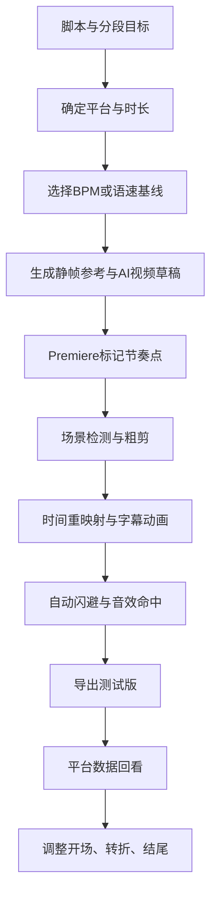
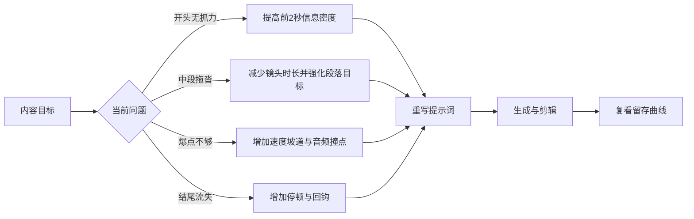

# 视频节奏把控提示词研究报告

## 执行摘要

“视频节奏”在生产层面并不只是“卡点”。从官方工具文档看，至少有六个可被明确操控的节奏维度：镜头动作与运镜、镜头切换点、速度变化、字幕/文字动画、音乐响度起伏，以及时间线上的标记与场景切分。Runway 的官方提示指南明确把视频提示词的核心放在 motion、camera work、temporal progression；Adobe 则把标记、场景编辑检测、时间重映射、关键帧图表、文本动画器与自动闪避音频都公开为可调节的时间控制手段。换句话说，节奏是“时间上的设计”，不是单一的转场风格。 citeturn14view0turn17view1turn18view1turn17view4turn22view5turn18view3

对内容创作者来说，最实用的结论有三点。第一，AI 文生视频提示词应当把“动作、速度、方向、镜头、时间顺序”写在前面，而不是过度堆砌外观形容词；这与 Runway 官方对 image-to-video 的建议一致。第二，剪辑软件里的节奏控制最好先做“节奏地图”再做镜头细节：用 Premiere 标记重要时点、用场景编辑检测找原始切点、用时间重映射做速度坡道、用自动闪避给人声让位。第三，节奏优化必须闭环到平台数据：YouTube Shorts 已把 “Stayed to watch” 定义为用户是否越过开头几秒继续观看的指标，Audience retention 还能显示用户在哪些时刻开始和停止观看；Meta 则给出实证，9:16、带音频、关键信息位于安全区内的 Reels 广告素材表现更好。 citeturn14view0turn18view2turn18view1turn17view4turn18view3turn15view2turn15view1turn5search1

基于这些官方约束，本文给出一套可直接复制的中文节奏提示词库。结构上分为“开场抓钩、主体推进、爆点转折、收束回钩”四个阶段；每一组都同时提供静帧参考、AI 视频提示、AE/PR/CapCut 参数化提示，以及配乐/音效提示，方便在 Midjourney、Stable Image、Runway、Premiere、After Effects、CapCut 等不同环节复用。涉及平台适配时，优先遵循官方公开信息：YouTube 的留存指标、Meta 的 9:16 与安全区建议、快手电脑端 60fps 上传支持，以及 CapCut Auto Cut 在 2026 年仍主要支持桌面端与移动端、不支持网页端。 citeturn15view2turn15view1turn5search1turn15view3turn16view2turn16view3

## 目录

- 节奏把控的底层逻辑  
- 平台与工具的官方启发  
- 可复用的提示词语法  
- 可直接复制的提示词库  
- 风格变体对照  
- 应用流程与质检方法  

## 节奏把控的底层逻辑

如果把视频节奏拆开，会发现它本质上由“时长、密度、速度、方向、留白、响度”六件事组成。Runway 官方把视频提示词中最关键的部分归纳为 subject action、environmental motion、camera motion、motion style & timing、direction & speed；Adobe 的时间线工具又把这些维度进一步落成了标记、关键帧、时间重映射、图表编辑器、文本动画器和自动闪避。也就是说，节奏提示词最好写成“谁在动、怎么动、朝哪动、动多快、何时切、何时停”。 citeturn14view0turn21view1turn22view5turn18view0turn18view3

一个非常实用的基础公式是：**一拍时长 = 60 ÷ BPM**。例如，90 BPM 约等于每拍 0.667 秒，120 BPM 为 0.5 秒，140 BPM 为 0.429 秒，160 BPM 为 0.375 秒；如果按常见四拍一小节计算，则分别约为 2.667 秒、2 秒、1.714 秒、1.5 秒。这意味着你在写“切镜速度”或“字幕弹出节奏”时，可以直接写成“每一拍一切”“每半拍一闪”“一小节后拉近”，而不是凭感觉。 citeturn25calculator0turn25calculator1turn25calculator2turn25calculator3turn26calculator0turn26calculator1turn26calculator2turn26calculator3

| BPM | 每拍时长 | 四拍时长 | 适合的基础节奏感 |
|---|---:|---:|---|
| 90 | 0.667s | 2.667s | 稳、叙述、纪录、知识口播 |
| 120 | 0.500s | 2.000s | 标准短视频、vlog、教程 |
| 140 | 0.429s | 1.714s | 科技快剪、对比、产品节奏 |
| 160 | 0.375s | 1.500s | 高能混剪、热血、转折爆点 |

在实际制作里，建议采用“**前密—中稳—爆点再密—结尾留停**”的基础结构。这样既能服务平台前几秒留存，也能给观众建立理解空间。YouTube 官方不仅提供 Shorts 的 “Stayed to watch”，还提供视频级 Audience retention，并明确说你可以用“观众在哪些时刻开始和停止观看”的数据来改进内容与维持兴趣；因此，节奏不是一开始就能完美写对，而是要从数据回看中修正开场、转折和收束。 citeturn15view2turn15view1

## 平台与工具的官方启发

下面这张表把官方文档能直接转化为“节奏提示词”的部分，压缩成了可执行规则。

| 来源 | 官方要点 | 对节奏提示词的直接启发 |
|---|---|---|
| Runway | Image-to-Video 提示词应主要描述 motion、camera work、temporal progression；可用 sequential prompting 与粗时间戳控制事件顺序；静机位可明确写 locked-off camera remains perfectly still。 citeturn14view0 | 提示词动词前置，写“镜头如何动、主体何时动、先后顺序是什么”，必要时写 `[00:01] / [00:03]`。 |
| Midjourney | 参数必须放在提示词末尾；参数用于改变图像形状与控制方式。 citeturn15view5 | 静帧参考图提示词主体写完后，再补 `--ar 9:16`、`--stylize` 等，避免参数打断语义。 |
| Stability Image | 支持 negative_prompt、style_preset、cfg_scale；图生图 strength 控制原图影响程度；多提示词支持权重，负权重可用于避免某些概念。 citeturn6search2turn6search4turn6search1 | 节奏参考帧可先锁构图，再用 strength 微调风格；“不要花哨背景、不要多主体、不要复杂透视”适合写成负向限制。 |
| Stable Audio | 强描述性的 prompt 更能定义 instruments、moods、styles、genre；duration、steps、cfg_scale、strength 可控；可做 text-to-audio 与 audio-to-audio。 citeturn24search0 | 配乐提示词要写情绪、乐器、速度、段落变化，而不是只写“高级感 BGM”。 |
| Premiere Pro | 标记可用名称、注释、颜色快速定位时刻；场景编辑检测可自动加切点或标记；时间重映射可加速度关键帧并用贝塞尔手柄做平滑过渡；自动闪避会生成关键帧，fade duration 决定响应速度。 citeturn18view2turn18view1turn17view4turn18view3 | 先做节奏地图，再做精修；把“切点、字幕点、音效点、CTA点”标出来，速度坡道与音乐让位都可写成参数化提示。 |
| After Effects | 动画可用关键帧、图表编辑器、表达式完成；文本动画器+选择器适合逐字/逐词控制；运动模糊可让文字移动更平滑；摄像机可选单节点/双节点，双节点围绕目标点定向。 citeturn21view1turn22view5turn19view3turn18view0turn22view1turn22view3 | 文字节奏不要只改不透明度，可同时控制范围选择器、位置和模糊；复杂运镜可写“二节点相机+目标点+缓动”。 |
| CapCut | Auto Cut 可按 Beat Sync、Speech Pause Detection、Script-Based Editing 切分；桌面端与移动端支持，网页端截至 2026 年仍不支持。 citeturn16view2turn16view3 | 做快节奏短视频时，可先自动切，再手调强拍与字幕；网页端流程要避开对 Auto Cut 的依赖。 |
| YouTube | Shorts Reach 中有 Stayed to watch；Retention 可看用户在哪些时刻开始和停止观看。 citeturn15view2turn15view1 | 开场提示词必须服务“过初秒”；结尾需要避免掉崖式流失。 |
| Meta Reels | 带音频、9:16、关键信息在 safe zone 内的 Reels 创意测试效果更好。 citeturn5search1 | 大字标题、字幕弹入、CTA 都要留安全边距；音频不是附加项，而是节奏的核心组成。 |
| 快手 | 电脑端支持无压缩上传且支持 60fps。 citeturn15view3 | 节奏密、动作快、镜头切短的内容，优先保留高帧率导出与上传链路。 |

## 可复用的提示词语法

把节奏提示词写对，最有效的方法不是收集零散关键词，而是先固定输入语法。结合 Runway、Midjourney、Stability、Stable Audio 以及 Adobe 的官方能力，建议用下面四套句型。 citeturn14view0turn15view5turn6search2turn6search4turn24search0turn21view1

**静帧参考语法**

`为【主题】生成一张用于短视频节奏设计的参考帧：主体【景别】、构图【留白/中心/对角】、画面信息密度【低/中/高】、标题安全区在【上/中/下】、情绪【紧张/克制/兴奋/悬疑】、风格【极简/电影感/科技/复古/卡通】、强调“第一眼就懂”的冲突点、9:16。`

这类提示适合 Midjourney 或 Stable Image。若用 Midjourney，比例等参数放在句尾；若用 Stability 图生图，先确定参考帧，再通过 strength 控制改动幅度。 citeturn15view5turn6search2turn6search1

**AI 视频节奏语法**

`镜头【推进/拉远/横移/摇镜/俯冲/锁定】，主体在【时长】内完成【动作】，环境做【轻微/明显】运动，字幕在【时间点】出现并在【时间点】消失，整体是【连续无切/强节拍切镜/停顿后爆发】的节奏，[00:01] 【事件A】，[00:03] 【事件B】，[00:04] 【事件C】。`

这套句型直接来自 Runway 的“camera + subject + additional descriptions”结构，以及它对 sequential prompting 的建议。 citeturn14view0

**AE/PR/CapCut 参数语法**

`时间线节奏方案：M1=0f 开场钩子，M2=12f 文案命中，M3=24f 切镜；缩放 100→108，位置 Y 20→0，不透明度 0→100，关键帧缓出；需要冲击时在 M2 前 3f 加速度坡道，在 M2 后 2f 加音效命中；背景音乐在人声区间自动闪避，fade duration 设快。`

这类写法的依据是 Premiere 的标记、场景编辑检测、时间重映射与自动闪避，以及 AE 的关键帧与图表编辑器逻辑。 citeturn18view2turn18view1turn17view4turn18view3turn22view5

**配乐与音效语法**

`生成一段【BPM】、【情绪】、【乐器】主导的配乐，前【时长】保持克制，中段逐步加层，爆点加入【鼓点/低频/合成器上升】，结尾保留【余韵/停顿/反拍回钩】；避免旋律过满，给字幕与人声留出空间。`

Stable Audio 官方明确建议把 instruments、moods、styles、genre 写清楚；简单 prompt 更利于干净输出，复杂 prompt 更适合增加纹理与层次。 citeturn24search0

下面两张流程图展示了“节奏从创意到落地”的完整链路。

## 可直接复制的提示词库

下面的模板按四个阶段组织。每一行都给出四种可直接复制的写法：**静帧/封面参考、AI 视频提示、AE/PR/CapCut 参数提示、BGM/SFX 提示**。为了便于复用，统一使用占位符【主题】【风格】【BPM】【平台】。这些模板的写法遵循前文官方工具的约束：动词前置、时间点明确、参数可落地、音频可分段。 citeturn14view0turn15view5turn6search2turn18view2turn17view4turn18view3turn24search0

**开场抓钩阶段**

| 用途 | 静帧/封面提示词 | AI 视频提示词 | AE/PR/CapCut 参数提示词 | BGM / SFX 提示词 |
|---|---|---|---|---|
| 冲突先行 | 为【主题】生成短视频开场参考帧：主体中近景，画面里出现一个即将发生的冲突线索，背景简洁，顶部留两行标题安全区，强对比光影，第一眼就能看懂矛盾，9:16，【风格】 | 镜头在 0.6 秒内从中景快速推进到特写，主体立即做出关键动作，背景元素轻微晃动，字幕在 0.2 秒弹入，整体连续无切、节奏紧、冲突先于解释 | M1=0f；0-12f 缩放 100→112、位置 Y 15→0、缓出；6f 加第一个标题；12f 切镜；若有音乐，强拍对齐 M1 | 生成一段 120-140 BPM 的紧张开场，短促低频脉冲、断音鼓点、一个上升型 whoosh，在第 1 拍命中 |
| 结果先给 | 为【主题】生成“结论先展示”的封面静帧：画面直接呈现最终效果，主体占画面 60%，留出中央一句结果文案位置，信息密度高但背景不杂乱，9:16 | 开头先给最终结果特写，0.4 秒后快速拉远露出过程痕迹，字幕先出现“结果”，再在第二拍补“怎么做到的” | 0-8f 不透明度 0→100；0-10f 缩放 108→100；10f 加第二行字幕；16f 切回过程镜头；Auto Cut 只保留强拍切点 | 生成一段“先命中、后铺陈”的短配乐：第一拍有明确撞点，随后鼓组减弱，让出旁白 |
| 问句抓钩 | 生成知识/口播视频开场静帧：人物看向镜头，表情有疑问感，背景保持简洁，标题区只放一个高信息问题句，9:16，【风格】 | 锁定镜头，主体在 0.8 秒内完成抬眼或转头动作，问题字幕逐字出现，最后一个字在强拍命中 | 锁机位；标题范围选择器从 0→100%；每 3f 出现一组字；最后 2f 加轻微 punch in；对白区音乐自动闪避 | 生成克制、留白多的前 2 秒音频：弱鼓点、少旋律、一个提问式提示音，避免盖住人声 |
| 节拍切片 | 生成快剪混剪开场关键帧：多个动作的代表性瞬间拼贴为一张高能参考图，主体层次分明，边缘保留安全区，科技或热血风格，9:16 | 在 1 小节内完成 4 个动作切片：每拍切一次，镜头方向交替，动作从左到右推进，最后一拍停在主视觉上 | M1~M4 每拍一标记；每段镜头 8-12f；转场只用硬切或极短闪白；第三拍前加 4f 速度坡道 | 生成 140-160 BPM 的卡点音乐，清晰军鼓与短低频，允许每拍一击，结尾留半拍停顿 |
| 静默拉近 | 生成悬疑或情绪类开场参考帧：单主体、低饱和、留白大、中央或偏下方留字幕位，第一眼有未完成感，9:16 | 镜头极慢推进，环境几乎静止，0.7 秒无字幕，随后淡入一句短文案，强调“晚半拍开口”的节奏 | 0-18f 缩放 100→104；0-10f 不上字；11f 字幕淡入 0→100；加轻微暗角和缓入 | 生成稀疏、悬停感的音频：低频氛围铺底，前 1 秒避免主旋律，第 2 秒给细小空气感提示 |

**主体推进阶段**

| 用途 | 静帧/封面提示词 | AI 视频提示词 | AE/PR/CapCut 参数提示词 | BGM / SFX 提示词 |
|---|---|---|---|---|
| 讲解推进 | 生成教程/解说参考帧：主体清晰，旁边预留步骤字幕区，画面层次简洁，强调“看得懂优先”，9:16 | 镜头保持稳定，主体动作与口播同步，每句结束后给 2-4f 的视觉停顿，字幕按语义块出现而非逐字狂闪 | 用语义块而非单字切；每句末尾插 2-4f 停顿；PR 标记按句号/停顿点布置；CapCut 选择 Speech Pause Detection | 生成 100-120 BPM 的中性节奏底乐，鼓点稳定，避免过多抢拍元素，给旁白留空间 |
| 对比切换 | 生成前后对比参考帧：左/右或上/下双区构图，差异明显，中央留对比标题，9:16 | 每个比较项保持 0.5-1 小节，切换时只改变一个变量，镜头方向保持一致，避免无意义的炫技转场 | 对比镜头统一长度；切换用恒定功率音频过渡或极短硬切；字幕只换关键词，版式不换 | 生成有秩序感的节奏底乐：固定鼓型、轻度上升感，每次切换点给短 click 或 whoosh |
| 步骤分段 | 生成步骤视频参考帧：步骤编号醒目，画面主次清楚，留出编号、关键词、说明三层信息区，9:16 | 每一步先给结果 0.3 秒，再展示动作过程，镜头在步骤变更时轻轻推近，强调“步骤递进” | M1=步骤号出现；M2=动作开始；M3=结果定格；编号使用范围选择器；每一段结束保留 2f 静止帧 | 生成分段清晰的配乐：每段开始有轻微提示音，主鼓不过度变化，便于观众识别步骤边界 |
| 场景陪跑 | 生成旅行、vlog、生活流中段参考帧：画面自然，留白适中，强调连贯行进感，色调统一，9:16 | 相机以稳定横移或跟拍推进，主体与环境一起动，用连续运动代替频繁切镜，让中段“不散但不累” | 尽量少切，改用位置关键帧与轻微速度调整；若切镜，方向保持一致；图表编辑器做平滑缓入缓出 | 生成 95-115 BPM 的陪伴感节奏，轻鼓+和弦铺底，避免频繁爆点，维持持续流动感 |
| 数据跟拍 | 生成数据/榜单/信息类参考帧：数字是主角，背景降噪，保留大号数字与短标题位置，9:16 | 镜头轻微推进，数字在强拍处切换，字幕只突出变化值，避免一屏塞满解释 | 数字用 AE 文本动画器逐组跳变；每次变化点加标记；图表编辑器控制数字与镜头不同步 2-3f，形成层次 | 生成有“计数”感的电子节拍：干净 click、轻量 synth、每次数字变化给短促提示音 |

**爆点转折阶段**

| 用途 | 静帧/封面提示词 | AI 视频提示词 | AE/PR/CapCut 参数提示词 | BGM / SFX 提示词 |
|---|---|---|---|---|
| Whip Pan 转折 | 生成转折关键帧：主体方向即将反转，背景有速度感线索，画面边缘允许轻微运动模糊，9:16 | 先向左快速 whip pan，再反向 whip pan 回到新主体，第二个主体成为新段落焦点，整体是“甩出去再抓回来”的节奏 | 两个切点之间插入 3-5f 定向模糊或运动模糊；M2 对齐第二主体出现；避免转场过长 | 生成两次明显甩镜 whoosh，中间插一记短打击，第二记更重，用来确立转折点 |
| 速度坡道爆点 | 生成爆点前参考帧：动作尚未完成，张力被拉满，主体边缘锐利，背景简化，9:16 | 先正常速度推进，爆点前突然慢下来，爆点瞬间恢复或超速，镜头同步轻微推进，突出“憋住再释放” | 时间重映射：M1 前 8f 100%→40%，M1 后 4f 40%→160%；关键帧加贝塞尔手柄做平滑坡道 | 生成“先吸气后砸下去”的音频：爆点前 riser，命中点给重 kick+impact，随后迅速回落 |
| 粒子/光效命中 | 生成高能命中参考帧：中心主视觉清晰，允许粒子、火花、HUD 或光圈爆闪，但主体边界不能被遮挡，9:16 | 主体动作命中时，环境粒子在 0.2 秒内外扩，镜头只做微推进，避免粒子抢夺主体叙事 | AE：在 M1 增加粒子爆发、发光与镜头轻推；PR：只做短闪白与击中音对齐；不要让特效持续过长 | 生成 1 次明确 impact、1 次高频闪击、1 条极短尾音，命中后立即收干，不拖泥带水 |
| 视角坠落 | 生成强冲击转折静帧：俯冲或下坠视角，透视强，主体位于视觉牵引中心，9:16 | 镜头从高位快速俯冲到主体附近，在最后 0.3 秒减速并定住，形成“掉下去但收得住”的感觉 | 二节点相机，目标点锁主体；位置 Z 快速变化，最后 6f 缓出；可加轻微景深但别过度糊 | 生成下降型 riser 与低频下坠音，落点用短重击固定空间感 |
| 停顿后爆发 | 生成爆发前一帧参考图：画面近乎停住，元素压抑、蓄力、安静，字幕极少，9:16 | 前 0.5 秒几乎静止，随后连续两到三个镜头快速命中，字幕在第二个命中点才出现，形成延迟满足 | 在 M1 前留 6-8f 静帧；M1 后 2 段短切；第三段回到主视觉；音乐 ducking 避开人声起句 | 生成“静—爆—收”的三段式音频：先极轻氛围，再两拍强打击，最后短余音收住 |

**收束回钩阶段**

| 用途 | 静帧/封面提示词 | AI 视频提示词 | AE/PR/CapCut 参数提示词 | BGM / SFX 提示词 |
|---|---|---|---|---|
| 情绪回落 | 生成结尾回落参考帧：画面干净，主体回到稳定状态，字幕空间充足，色彩略降饱和，9:16 | 爆点后的镜头逐步稳定下来，动作减小，字幕只保留一句结论，结尾停 0.4-0.8 秒让情绪落地 | 结尾 10-16f 减少运动，缩放轻回 102→100，不透明度平稳；不要再加新信息 | 生成能量回落段：主鼓退后、保留和声或 pad，结尾不要硬断，留短尾音 |
| 结论定格 | 生成结论页参考帧：标题短、能记住，主体或关键信息处在中央安全区，构图稳，9:16 | 镜头在最后 0.5 秒完全稳定，结论字幕淡入后保持可读，不再切镜，让用户有读完时间 | 最后一句字幕至少完整停留 12-18f；若有 CTA，结论与 CTA 分两拍出现，不要同时弹出 | 生成简洁收束型尾音：轻钟声、柔和 pad 或温和 synth，帮助记忆，不要喧宾夺主 |
| CTA 收束 | 生成行动号召结尾参考帧：按钮感或指向感明确，保留关注/评论/收藏安全区，信息层级清楚，9:16 | 主体看向或指向 CTA 区域，镜头轻微推近，CTA 在结尾后半拍出现，避免压在结论上 | CTA 单独占一拍；字幕使用弹性缓出；结论先出现，CTA 后出现；保留 0.3 秒结尾停顿 | 生成轻量提示型尾音：不夸张，但有“结束+引导行动”的辨识度，可加短 click 或 chime |
| 循环回钩 | 生成可循环片尾参考帧：最后一帧能自然接回第一帧，构图、色调和主体方向可闭环，9:16 | 结尾镜头必须回到与开头相近的构图与主体朝向，最后 0.2 秒保持稳定，适合无缝循环 | PR/AE：最后一帧回对第一帧；Runway 直写“camera must start and end on the exact same frame to create a perfect loop” | 生成循环友好音频：尾音不能明显断崖，最后 1 拍与第一拍频谱兼容 |
| 余韵留白 | 生成诗性或情绪片尾参考帧：单主体、留白大、文字少、色调柔和，9:16 | 最后只保留一个微动作，镜头轻轻后退或静止，字幕渐隐，不用急着切黑，让观众停半秒 | 结尾做慢淡出，字幕 100→0；用图表编辑器把最后一段曲线拉平；不加多余转场 | 生成余韵型尾段：低音量 pad、长尾混响、没有新鼓点，用来延长情绪停驻 |

## 风格变体对照

同一条视频，换风格时应该一起改的不是“视觉形容词”而已，还包括**镜头幅度、字幕字数、镜头时长、音效密度、结尾停顿长度**。Runway 把 motion style & timing 单独列为一个维度，Adobe 则把文本动画、运镜、关键帧图表都作为独立控制项；所以“电影感”和“综艺感”的差异，本质上是时间组织方式不同。 citeturn14view0turn22view5turn18view0turn22view1

| 风格 | 视觉节奏 | 镜头与剪切提示词差异 | 字幕提示词差异 | 配乐提示词差异 |
|---|---|---|---|---|
| 极简 | 少切镜、少色彩、留白大 | 使用“锁机位、轻推近、连续镜头、减少无效转场” | 使用“短句、单层级、慢一点出现、完整停留” | 使用“弱鼓点、稀疏、少旋律、给口播留空间” |
| 电影感 | 运镜主导，剪切相对克制 | 使用“二节点相机、目标点、缓慢推进、景深、速度坡道” | 使用“少字、低位置、和画面一起呼吸” | 使用“氛围铺底、渐进加层、爆点前蓄力” |
| 科技感 | 高密度、强方向、节拍清晰 | 使用“快速横移、whip pan、HUD、每拍切、故障闪切” | 使用“关键词高亮、数字跳动、对齐强拍” | 使用“电子脉冲、click、短促 synth、低频命中” |
| 综艺感 | 高频 punch in、反应镜头多 | 使用“表情切换、弹跳字幕、夸张放大、反拍插入” | 使用“字大、节奏快、弹性缓动、拟声词” | 使用“卡点鼓、夸张转场声、反应音效、短笑点提示” |
| 复古 | 节奏不必极快，但段落感强 | 使用“轻摇镜、慢推、胶片颗粒、淡入淡出、磁带停连” | 使用“衬线字、低对比、慢显、少动画” | 使用“磁带底噪、复古鼓机、弦乐或 Rhodes、电平不过满” |

如果你只想保留一组“通用替换规则”，可以直接用下面这一段：

> 把【风格】从“极简”切到“科技感”时：把锁机位改为快速横移，把每句一屏字幕改为关键词强拍弹入，把配乐从稀疏铺底改为电子脉冲+短低频命中，把镜头切换从每小节一次改为每拍或半拍一次，但保留结论与 CTA 的可读停留时间。

## 应用流程与质检方法

真正决定节奏是否有效的，不是你写了多少“高级词”，而是提示词能不能转成**可检查**的结果。Premiere 的标记与场景编辑检测，AE 的图表编辑器与文本选择器，CapCut 的 Beat Sync / Speech Pause Detection，Runway 的 sequential prompting，都在说明同一件事：节奏应该先“可测量”，再“可审美”。 citeturn18view2turn18view1turn22view5turn19view3turn16view2turn14view0

下面是一套适合短视频创作者的质检表。它把平台数据和制作软件的控制点连接起来。

| 检查维度 | 你该问的问题 | 优先工具/指标 |
|---|---|---|
| 开头抓力 | 开头几秒是否只传达一个核心信息？ | YouTube 的 Stayed to watch；首秒停留与跳出观察。 citeturn15view2 |
| 中段流失 | 哪些句子或镜头之后观众开始离开？ | YouTube Audience retention。 citeturn15view1 |
| 信息遮挡 | 关键字幕、CTA 是否压到平台 UI 区域？ | Reels safe zone 思维，重点信息保留在安全区。 citeturn5search1 |
| 人声可读性 | 配乐是否抢掉旁白？ | Premiere 自动闪避、淡化持续时间与关键帧。 citeturn18view3 |
| 切点准确性 | 强拍、台词停顿、动作命中是否对齐？ | Premiere 标记、CapCut Beat Sync / Speech Pause Detection。 citeturn18view2turn16view2 |
| 运镜自然性 | 加速或减速是否突兀？ | Premiere 时间重映射的贝塞尔手柄；AE 图表编辑器。 citeturn17view4turn22view5 |
| 文本可读性 | 字幕是否出得太快、退得太早？ | AE 文本动画器/选择器；结尾保留完整阅读时间。 citeturn19view3turn18view0 |
| 输出清晰度 | 高节奏快动作画面是否被平台处理得发糊？ | 快手电脑端可走无压缩上传并支持 60fps。 citeturn15view3 |

最后给出一份**速用清单**，适合直接贴到你的项目文档或 AI 工具备注区：

**节奏设计速用总提示词**

- 开场先写冲突、结果或问题，避免一开始解释背景。  
- AI 视频提示词先写动作、速度、方向、镜头，再写风格。  
- 每段都先定“这 1 到 2 秒唯一要让观众记住什么”。  
- 口播类中段用语义块节奏，不要逐字狂闪。  
- 爆点前先停半拍或减速，再放大命中感。  
- 结尾一定给结论完整停留，再出现 CTA。  
- 要做循环，就在提示词里明确要求“首尾同帧/同构图/同朝向”。  
- 配乐提示词务必写 BPM、情绪、乐器、段落起伏。  
- 剪辑前先打标记；没有 marker 的节奏优化往往只能靠返工。  
- 复盘不要只看总播放量，优先看“初秒是否留下”“哪里开始流失”。 citeturn18view2turn15view2turn15view1turn24search0turn14view0